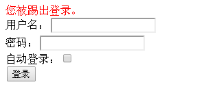

# 18. 并发登录人数控制

在某些项目中可能会遇到如每个账户同时只能有一个人登录或几个人同时登录，如果同时有多人登录：要么不让后者登录；要么踢出前者登录（强制退出）。比如 spring security 就直接提供了相应的功能；Shiro 的话没有提供默认实现，不过可以很容易的在 Shiro 中加入这个功能。  
 
示例代码基于《第十六章 综合实例》完成，通过 Shiro Filter 机制扩展 KickoutSessionControlFilter 完成。  
 
**首先来看看如何配置使用（spring-config-shiro.xml）**
  
kickoutSessionControlFilter 用于控制并发登录人数的 

```
<bean id="kickoutSessionControlFilter" 
class="com.github.zhangkaitao.shiro.chapter18.web.shiro.filter.KickoutSessionControlFilter">
    <property name="cacheManager" ref="cacheManager"/>
    <property name="sessionManager" ref="sessionManager"/>
    <property name="kickoutAfter" value="false"/>
    <property name="maxSession" value="2"/>
    <property name="kickoutUrl" value="/login?kickout=1"/>
</bean>&nbsp;
```  

cacheManager：使用 cacheManager 获取相应的 cache 来缓存用户登录的会话；用于保存用户—会话之间的关系的；  
sessionManager：用于根据会话 ID，获取会话进行踢出操作的；  
kickoutAfter：是否踢出后来登录的，默认是 false；即后者登录的用户踢出前者登录的用户；  
maxSession：同一个用户最大的会话数，默认 1；比如 2 的意思是同一个用户允许最多同时两个人登录；  
kickoutUrl：被踢出后重定向到的地址；  

shiroFilter 配置  

```
   <bean id="shiroFilter" class="org.apache.shiro.spring.web.ShiroFilterFactoryBean">
        <property name="securityManager" ref="securityManager"/>
        <property name="loginUrl" value="/login"/>
        <property name="filters">
            <util:map>
                <entry key="authc" value-ref="formAuthenticationFilter"/>
                <entry key="sysUser" value-ref="sysUserFilter"/>
                <entry key="kickout" value-ref="kickoutSessionControlFilter"/>
            </util:map>
        </property>
        <property name="filterChainDefinitions">
            <value>
                /login = authc
                /logout = logout
                /authenticated = authc
                /** = kickout,user,sysUser
            </value>
        </property>
    </bean>&nbsp;
```

此处配置除了登录等之外的地址都走 kickout 拦截器进行并发登录控制。

**测试**

此处因为 maxSession=2，所以需要打开 3 个浏览器（需要不同的浏览器，如 IE、Chrome、Firefox），分别访问 [http://localhost:8080/chapter18/](http://localhost:8080/chapter18/) 进行登录；然后刷新第一次打开的浏览器，将会被强制退出，如显示下图：



KickoutSessionControlFilter 核心代码：  

```
protected boolean onAccessDenied(ServletRequest request, ServletResponse response) throws Exception {
    Subject subject = getSubject(request, response);
    if(!subject.isAuthenticated() && !subject.isRemembered()) {
        //如果没有登录，直接进行之后的流程
        return true;
    }
    Session session = subject.getSession();
    String username = (String) subject.getPrincipal();
    Serializable sessionId = session.getId();
    //TODO 同步控制
    Deque<Serializable> deque = cache.get(username);
    if(deque == null) {
        deque = new LinkedList<Serializable>();
        cache.put(username, deque);
    }
    //如果队列里没有此sessionId，且用户没有被踢出；放入队列
    if(!deque.contains(sessionId) && session.getAttribute("kickout") == null) {
        deque.push(sessionId);
    }
    //如果队列里的sessionId数超出最大会话数，开始踢人
    while(deque.size() > maxSession) {
        Serializable kickoutSessionId = null;
        if(kickoutAfter) { //如果踢出后者
            kickoutSessionId = deque.removeFirst();
        } else { //否则踢出前者
            kickoutSessionId = deque.removeLast();
        }
        try {
            Session kickoutSession =
                sessionManager.getSession(new DefaultSessionKey(kickoutSessionId));
            if(kickoutSession != null) {
                //设置会话的kickout属性表示踢出了
                kickoutSession.setAttribute("kickout", true);
            }
        } catch (Exception e) {//ignore exception
        }
    }
    //如果被踢出了，直接退出，重定向到踢出后的地址
    if (session.getAttribute("kickout") != null) {
        //会话被踢出了
        try {
            subject.logout();
        } catch (Exception e) { //ignore
        }
        saveRequest(request);
        WebUtils.issueRedirect(request, response, kickoutUrl);
        return false;
    }
    return true;
}&nbsp;
```

此处使用了 Cache 缓存用户名—会话 id 之间的关系；如果量比较大可以考虑如持久化到数据库 / 其他带持久化的 Cache 中；另外此处没有并发控制的同步实现，可以考虑根据用户名获取锁来控制，减少锁的粒度。  

另外可参考 JavaEE 项目开发脚手架，其提供了后台踢出用户的功能：  
[https://github.com/zhangkaitao/es/blob/master/web/src/main/java/com/sishuok/es/sys/user/web/controller/UserOnlineController.java](https://github.com/zhangkaitao/es/blob/master/web/src/main/java/com/sishuok/es/sys/user/web/controller/UserOnlineController.java)  


