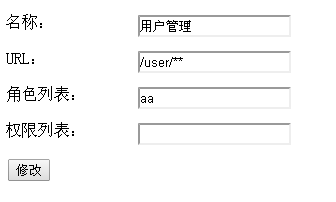

# 19. 动态 URL 权限控制

用过 Spring Security 的朋友应该比较熟悉对 URL 进行全局的权限控制，即访问 URL 时进行权限匹配；如果没有权限直接跳到相应的错误页面。Shiro 也支持类似的机制，不过需要稍微改造下来满足实际需求。不过在 Shiro 中，更多的是通过 AOP 进行分散的权限控制，即方法级别的；而通过 URL 进行权限控制是一种集中的权限控制。本章将介绍如何在 Shiro 中完成动态 URL 权限控制。
 
本章代码基于《第十六章 综合实例》，请先了解相关数据模型及基本流程后再学习本章。  

**表及数据 SQL**

请运行 shiro-example-chapter19/sql/ shiro-schema.sql 表结构  
请运行 shiro-example-chapter19/sql/ shiro-schema.sql 数据  
 
**实体**

具体请参考 com.github.zhangkaitao.shiro.chapter19 包下的实体。   

```
public class UrlFilter implements Serializable {
    private Long id;
    private String name; //url名称/描述
    private String url; //地址
    private String roles; //所需要的角色，可省略
    private String permissions; //所需要的权限，可省略
}&nbsp;
```

表示拦截的 URL 和角色 / 权限之间的关系，多个角色 / 权限之间通过逗号分隔，此处还可以扩展其他的关系，另外可以加如 available 属性表示是否开启该拦截。

**DAO**

具体请参考 com.github.zhangkaitao.shiro.chapter19.dao 包下的 DAO 接口及实现。
 
**Service**

具体请参考 com.github.zhangkaitao.shiro.chapter19.service 包下的 Service 接口及实现。

```
public interface UrlFilterService {
    public UrlFilter createUrlFilter(UrlFilter urlFilter);
    public UrlFilter updateUrlFilter(UrlFilter urlFilter);
    public void deleteUrlFilter(Long urlFilterId);
    public UrlFilter findOne(Long urlFilterId);
    public List<UrlFilter> findAll();
}
```

基本的 URL 拦截的增删改查实现。

```
@Service
public class UrlFilterServiceImpl implements UrlFilterService {
    @Autowired
private ShiroFilerChainManager shiroFilerChainManager;
    @Override
    public UrlFilter createUrlFilter(UrlFilter urlFilter) {
        urlFilterDao.createUrlFilter(urlFilter);
        initFilterChain();
        return urlFilter;
    }
    //其他方法请参考源码
    @PostConstruct
    public void initFilterChain() {
       shiroFilerChainManager.initFilterChains(findAll());
    }
}&nbsp;
```

UrlFilterServiceImpl 在进行新增、修改、删除时会调用 initFilterChain 来重新初始化 Shiro 的 URL 拦截器链，即同步数据库中的 URL 拦截器定义到 Shiro 中。此处也要注意如果直接修改数据库是不会起作用的，因为只要调用这几个 Service 方法时才同步。另外当容器启动时会自动回调 initFilterChain 来完成容器启动后的 URL 拦截器的注册。

**ShiroFilerChainManager**

```
@Service
public class ShiroFilerChainManager {
    @Autowired private DefaultFilterChainManager filterChainManager;
    private Map<String, NamedFilterList> defaultFilterChains;
    @PostConstruct
    public void init() {
        defaultFilterChains = 
          new HashMap<String, NamedFilterList>(filterChainManager.getFilterChains());
    }
    public void initFilterChains(List<UrlFilter> urlFilters) {
        //1、首先删除以前老的filter chain并注册默认的
        filterChainManager.getFilterChains().clear();
        if(defaultFilterChains != null) {
            filterChainManager.getFilterChains().putAll(defaultFilterChains);
        }
        //2、循环URL Filter 注册filter chain
        for (UrlFilter urlFilter : urlFilters) {
            String url = urlFilter.getUrl();
            //注册roles filter
            if (!StringUtils.isEmpty(urlFilter.getRoles())) {
                filterChainManager.addToChain(url, "roles", urlFilter.getRoles());
            }
            //注册perms filter
            if (!StringUtils.isEmpty(urlFilter.getPermissions())) {
                filterChainManager.addToChain(url, "perms", urlFilter.getPermissions());
            }
        }
    }
}&nbsp;
```

1、init：Spring 容器启动时会调用 init 方法把在 spring 配置文件中配置的默认拦截器保存下来，之后会自动与数据库中的配置进行合并。  
2、initFilterChains：UrlFilterServiceImpl 会在 Spring 容器启动或进行增删改 UrlFilter 时进行注册 URL 拦截器到 Shiro。  

拦截器及拦截器链知识请参考《第八章 拦截器机制》，此处再介绍下 Shiro 拦截器的流程：  

AbstractShiroFilter // 如 ShiroFilter/ SpringShiroFilter 都继承该 Filter
doFilter //Filter 的 doFilter
doFilterInternal // 转调 doFilterInternal
executeChain(request, response, chain) // 执行拦截器链    
FilterChain chain = getExecutionChain(request, response, origChain) // 使用原始拦截器链获取新的拦截器链  
chain.doFilter(request, response) // 执行新组装的拦截器链  
 
getExecutionChain(request, response, origChain) // 获取拦截器链流程  
FilterChainResolver resolver = getFilterChainResolver(); // 获取相应的   FilterChainResolver
FilterChain resolved = resolver.getChain(request, response, origChain); // 通过 FilterChainResolver 根据当前请求解析到新的 FilterChain 拦截器链  
 
默认情况下如使用 ShiroFilterFactoryBean 创建 shiroFilter 时，默认使用 PathMatchingFilterChainResolver 进行解析，而它默认是根据当前请求的 URL 获取相应的拦截器链，使用 Ant 模式进行 URL 匹配；默认使用 DefaultFilterChainManager 进行拦截器链的管理。
 
PathMatchingFilterChainResolver 默认流程：

```
public FilterChain getChain(ServletRequest request, ServletResponse response, FilterChain originalChain) {
    //1、首先获取拦截器链管理器
    FilterChainManager filterChainManager = getFilterChainManager();
    if (!filterChainManager.hasChains()) {
        return null;
    }
    //2、接着获取当前请求的URL（不带上下文）
    String requestURI = getPathWithinApplication(request);
    //3、循环拦截器管理器中的拦截器定义（拦截器链的名字就是URL模式）
    for (String pathPattern : filterChainManager.getChainNames()) {
        //4、如当前URL匹配拦截器名字（URL模式）
        if (pathMatches(pathPattern, requestURI)) {
            //5、返回该URL模式定义的拦截器链
            return filterChainManager.proxy(originalChain, pathPattern);
        }
    }
    return null;
}&nbsp;
```

默认实现有点小问题：  

如果多个拦截器链都匹配了当前请求 URL，那么只返回第一个找到的拦截器链；后续我们可以修改此处的代码，将多个匹配的拦截器链合并返回。   

DefaultFilterChainManager 内部使用 Map 来管理 URL 模式 - 拦截器链的关系；也就是说相同的 URL 模式只能定义一个拦截器链，不能重复定义；而且如果多个拦截器链都匹配时是无序的（因为使用 map.keySet() 获取拦截器链的名字，即 URL 模式）。  

FilterChainManager 接口：

```
public interface FilterChainManager {
    Map<String, Filter> getFilters(); //得到注册的拦截器
    void addFilter(String name, Filter filter); //注册拦截器
    void addFilter(String name, Filter filter, boolean init); //注册拦截器
    void createChain(String chainName, String chainDefinition); //根据拦截器链定义创建拦截器链
    void addToChain(String chainName, String filterName); //添加拦截器到指定的拦截器链
    void addToChain(String chainName, String filterName, String chainSpecificFilterConfig) throws ConfigurationException; //添加拦截器（带有配置的）到指定的拦截器链
    NamedFilterList getChain(String chainName); //获取拦截器链
    boolean hasChains(); //是否有拦截器链
    Set<String> getChainNames(); //得到所有拦截器链的名字
    FilterChain proxy(FilterChain original, String chainName); //使用指定的拦截器链代理原始拦截器链
}&nbsp;
```

此接口主要三个功能：注册拦截器，注册拦截器链，对原始拦截器链生成代理之后的拦截器链，比如  

```
<bean id="shiroFilter" class="org.apache.shiro.spring.web.ShiroFilterFactoryBean">
……
    <property name="filters">
        <util:map>
            <entry key="authc" value-ref="formAuthenticationFilter"/>
            <entry key="sysUser" value-ref="sysUserFilter"/>
        </util:map>
    </property>
    <property name="filterChainDefinitions">
        <value>
            /login = authc
            /logout = logout
            /authenticated = authc
            /** = user,sysUser
        </value>
    </property>
</bean>&nbsp;
```

filters 属性定义了拦截器；filterChainDefinitions 定义了拦截器链；如 /** 就是拦截器链的名字；而 user,sysUser 就是拦截器名字列表。
 
之前说过默认的 PathMatchingFilterChainResolver 和 DefaultFilterChainManager 不能满足我们的需求，我们稍微扩展了一下：  

**CustomPathMatchingFilterChainResolver **

```
public class CustomPathMatchingFilterChainResolver
             extends PathMatchingFilterChainResolver {
  private CustomDefaultFilterChainManager customDefaultFilterChainManager;
  public void setCustomDefaultFilterChainManager(
        CustomDefaultFilterChainManager customDefaultFilterChainManager) {
      this.customDefaultFilterChainManager = customDefaultFilterChainManager;
      setFilterChainManager(customDefaultFilterChainManager);
  }
  public FilterChain getChain(ServletRequest request, ServletResponse response, FilterChain originalChain) {
      FilterChainManager filterChainManager = getFilterChainManager();
      if (!filterChainManager.hasChains()) {
          return null;
      }
      String requestURI = getPathWithinApplication(request);
      List<String> chainNames = new ArrayList<String>();
      for (String pathPattern : filterChainManager.getChainNames()) {
        if (pathMatches(pathPattern, requestURI)) {
        chainNames.add(pathPattern);
        }
      }
      if(chainNames.size() == 0) {
        return null;
      }
      return customDefaultFilterChainManager.proxy(originalChain, chainNames);
  }
}&nbsp;
```

和默认的 PathMatchingFilterChainResolver 区别是，此处得到所有匹配的拦截器链，然后通过调用 CustomDefaultFilterChainManager.proxy(originalChain, chainNames) 进行合并后代理。  

**CustomDefaultFilterChainManager**

```
public class CustomDefaultFilterChainManager extends DefaultFilterChainManager {
    private Map<String, String> filterChainDefinitionMap = null;
    private String loginUrl;
    private String successUrl;
    private String unauthorizedUrl;
    public CustomDefaultFilterChainManager() {
        setFilters(new LinkedHashMap<String, Filter>());
        setFilterChains(new LinkedHashMap<String, NamedFilterList>());
        addDefaultFilters(true);
    }
    public Map<String, String> getFilterChainDefinitionMap() {
        return filterChainDefinitionMap;
    }
    public void setFilterChainDefinitionMap(Map<String, String> filterChainDefinitionMap) {
        this.filterChainDefinitionMap = filterChainDefinitionMap;
    }
    public void setCustomFilters(Map<String, Filter> customFilters) {
        for(Map.Entry<String, Filter> entry : customFilters.entrySet()) {
            addFilter(entry.getKey(), entry.getValue(), false);
        }
}
    public void setDefaultFilterChainDefinitions(String definitions) {
        Ini ini = new Ini();
        ini.load(definitions);
        Ini.Section section = ini.getSection(IniFilterChainResolverFactory.URLS);
        if (CollectionUtils.isEmpty(section)) {
            section = ini.getSection(Ini.DEFAULT_SECTION_NAME);
        }
        setFilterChainDefinitionMap(section);
    }
    public String getLoginUrl() {
        return loginUrl;
    }
    public void setLoginUrl(String loginUrl) {
        this.loginUrl = loginUrl;
    }
    public String getSuccessUrl() {
        return successUrl;
    }
    public void setSuccessUrl(String successUrl) {
        this.successUrl = successUrl;
    }
    public String getUnauthorizedUrl() {
        return unauthorizedUrl;
    }
    public void setUnauthorizedUrl(String unauthorizedUrl) {
        this.unauthorizedUrl = unauthorizedUrl;
    }
    @PostConstruct
    public void init() {
        Map<String, Filter> filters = getFilters();
        if (!CollectionUtils.isEmpty(filters)) {
            for (Map.Entry<String, Filter> entry : filters.entrySet()) {
                String name = entry.getKey();
                Filter filter = entry.getValue();
                applyGlobalPropertiesIfNecessary(filter);
                if (filter instanceof Nameable) {
                    ((Nameable) filter).setName(name);
                }
                addFilter(name, filter, false);
            }
        }
        Map<String, String> chains = getFilterChainDefinitionMap();
        if (!CollectionUtils.isEmpty(chains)) {
            for (Map.Entry<String, String> entry : chains.entrySet()) {
                String url = entry.getKey();
                String chainDefinition = entry.getValue();
                createChain(url, chainDefinition);
            }
        }
    }
    protected void initFilter(Filter filter) {
        //ignore 
    }
    public FilterChain proxy(FilterChain original, List<String> chainNames) {
        NamedFilterList configured = new SimpleNamedFilterList(chainNames.toString());
        for(String chainName : chainNames) {
            configured.addAll(getChain(chainName));
        }
        return configured.proxy(original);
    }
    private void applyGlobalPropertiesIfNecessary(Filter filter) {
        applyLoginUrlIfNecessary(filter);
        applySuccessUrlIfNecessary(filter);
        applyUnauthorizedUrlIfNecessary(filter);
    }
    private void applyLoginUrlIfNecessary(Filter filter) {
        //请参考源码
    }
    private void applySuccessUrlIfNecessary(Filter filter) {
        //请参考源码
    }
    private void applyUnauthorizedUrlIfNecessary(Filter filter) {
        //请参考源码
    }
}&nbsp;
```

1. CustomDefaultFilterChainManager：调用其构造器时，会自动注册默认的拦截器；
2. loginUrl、successUrl、unauthorizedUrl：分别对应登录地址、登录成功后默认跳转地址、未授权跳转地址，用于给相应拦截器的；
3. filterChainDefinitionMap：用于存储如 ShiroFilterFactoryBean 在配置文件中配置的拦截器链定义，即可以认为是默认的静态拦截器链；会自动与数据库中加载的合并；
4. setDefaultFilterChainDefinitions：解析配置文件中传入的字符串拦截器链配置，解析为相应的拦截器链；
5. setCustomFilters：注册我们自定义的拦截器；如 ShiroFilterFactoryBean 的 filters 属性；
6. init：初始化方法，Spring 容器启动时会调用，首先其会自动给相应的拦截器设置如 loginUrl、successUrl、unauthorizedUrl；其次根据 filterChainDefinitionMap 构建默认的拦截器链；
7. initFilter：此处我们忽略实现 initFilter，因为交给 spring 管理了，所以 Filter 的相关配置会在 Spring 配置中完成；
8. proxy：组合多个拦截器链为一个生成一个新的 FilterChain 代理。

**Web 层控制器**

请参考 com.github.zhangkaitao.shiro.chapter19.web.controller 包，相对于第十六章添加了 UrlFilterController 用于 UrlFilter 的维护。另外，移除了控制器方法上的权限注解，而是使用动态 URL 拦截进行控制。  

**Spring 配置——spring-config-shiro.xml**

```
<bean id="filterChainManager" 
    class="com.github.zhangkaitao.shiro.spring.CustomDefaultFilterChainManager">
    <property name="loginUrl" value="/login"/>
    <property name="successUrl" value="/"/>
    <property name="unauthorizedUrl" value="/unauthorized.jsp"/>
    <property name="customFilters">
        <util:map>
            <entry key="authc" value-ref="formAuthenticationFilter"/>
            <entry key="sysUser" value-ref="sysUserFilter"/>
        </util:map>
    </property>
    <property name="defaultFilterChainDefinitions">
        <value>
            /login = authc
            /logout = logout
            /unauthorized.jsp = authc
            /** = user,sysUser
        </value>
    </property>
</bean>&nbsp;
```

filterChainManager 是我们自定义的 CustomDefaultFilterChainManager，注册相应的拦截器及默认的拦截器链。

```
<bean id="filterChainResolver" 
    class="com.github.zhangkaitao.shiro.spring.CustomPathMatchingFilterChainResolver">
    <property name="customDefaultFilterChainManager" ref="filterChainManager"/>
</bean>&nbsp;
```

filterChainResolver 是自定义的 CustomPathMatchingFilterChainResolver，使用上边的 filterChainManager 进行拦截器链的管理。

```
<bean id="shiroFilter" class="org.apache.shiro.spring.web.ShiroFilterFactoryBean">
    <property name="securityManager" ref="securityManager"/>
</bean>&nbsp;
```

shiroFilter 不再定义 filters 及 filterChainDefinitions，而是交给了 filterChainManager 进行完成。  

```
<bean class="org.springframework.beans.factory.config.MethodInvokingFactoryBean">
    <property name="targetObject" ref="shiroFilter"/>
    <property name="targetMethod" value="setFilterChainResolver"/>
    <property name="arguments" ref="filterChainResolver"/>
</bean>&nbsp;
```

最后把 filterChainResolver 注册给 shiroFilter，其使用它进行动态 URL 权限控制。  

其他配置和第十六章一样，请参考第十六章。  

**测试**

1、首先执行 shiro-data.sql 初始化数据。  
2、然后再 URL 管理中新增如下数据：
 


3、访问 http://localhost:8080/chapter19/user 时要求用户拥有 aa 角色，此时是没有的所以会跳转到未授权页面；  
4、添加 aa 角色然后授权给用户，此时就有权限访问 http://localhost:8080/chapter19/user。
 
实际项目可以在此基础上进行扩展。


