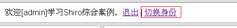
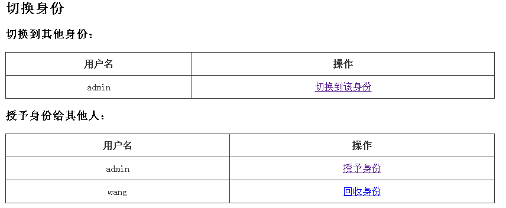
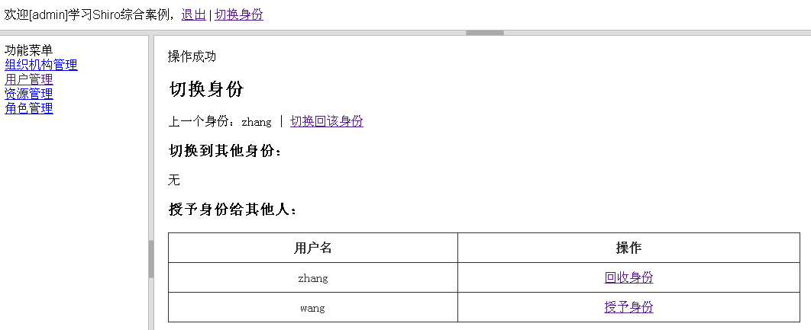

# 21. 授予身份及切换身份

在一些场景中，比如某个领导因为一些原因不能进行登录网站进行一些操作，他想把他网站上的工作委托给他的秘书，但是他不想把帐号 / 密码告诉他秘书，只是想把工作委托给他；此时和我们可以使用 Shiro 的 RunAs 功能，即允许一个用户假装为另一个用户（如果他们允许）的身份进行访问。
 
本章代码基于《第十六章 综合实例》，请先了解相关数据模型及基本流程后再学习本章。  

**表及数据 SQL**

请运行 shiro-example-chapter21/sql/ shiro-schema.sql 表结构  
请运行 shiro-example-chapter21/sql/ shiro-schema.sql 数据  
 
**实体**
 
具体请参考 com.github.zhangkaitao.shiro.chapter21 包下的实体。

```
public class UserRunAs implements Serializable {
    private Long fromUserId;//授予身份帐号
    private Long toUserId;//被授予身份帐号
}&nbsp;
```

该实体定义了授予身份帐号（A）与被授予身份帐号（B）的关系，意思是 B 帐号将可以假装为 A 帐号的身份进行访问。
 
**DAO**

具体请参考 com.github.zhangkaitao.shiro.chapter21.dao 包下的 DAO 接口及实现。
 
**Service**

具体请参考 com.github.zhangkaitao.shiro.chapter21.service 包下的 Service 接口及实现。

```
public interface UserRunAsService {
    public void grantRunAs(Long fromUserId, Long toUserId);
    public void revokeRunAs(Long fromUserId, Long toUserId);
    public boolean exists(Long fromUserId, Long toUserId);
    public List<Long> findFromUserIds(Long toUserId);
    public List<Long> findToUserIds(Long fromUserId);
}&nbsp;
```

提供授予身份、回收身份、关系存在判断及查找 API。
 
**Web 控制器 RunAsController**

该控制器完成：授予身份 / 回收身份 / 切换身份功能。
 
**展示当前用户能切换到身份列表，及授予给其他人的身份列表**：

```
@RequestMapping
public String runasList(@CurrentUser User loginUser, Model model) {
    model.addAttribute("fromUserIds", 
        userRunAsService.findFromUserIds(loginUser.getId()));
    model.addAttribute("toUserIds", userRunAsService.findToUserIds(loginUser.getId()));
    List<User> allUsers = userService.findAll();
    allUsers.remove(loginUser);
    model.addAttribute("allUsers", allUsers);
    Subject subject = SecurityUtils.getSubject();
    model.addAttribute("isRunas", subject.isRunAs());
    if(subject.isRunAs()) {
        String previousUsername =
                (String)subject.getPreviousPrincipals().getPrimaryPrincipal();
        model.addAttribute("previousUsername", previousUsername);
    }
    return "runas";
}&nbsp;
```

1. Subject.isRunAs()：表示当前用户是否是 RunAs 用户，即已经切换身份了；
2. Subject.getPreviousPrincipals()：得到切换身份之前的身份，一个用户可以切换很多次身份，之前的身份使用栈数据结构来存储；

**授予身份**

把当前用户身份授予给另一个用户，这样另一个用户可以切换身份到该用户。

```
@RequestMapping("/grant/{toUserId}")
public String grant(
        @CurrentUser User loginUser,
        @PathVariable("toUserId") Long toUserId,
        RedirectAttributes redirectAttributes) {
    if(loginUser.getId().equals(toUserId)) {
        redirectAttributes.addFlashAttribute("msg", "自己不能切换到自己的身份");
        return "redirect:/runas";
    }
    userRunAsService.grantRunAs(loginUser.getId(), toUserId);
    redirectAttributes.addFlashAttribute("msg", "操作成功");
    return "redirect:/runas";
}&nbsp;
```

1. 自己不能授予身份给自己；
2. 调用 UserRunAsService. grantRunAs 把当前登录用户的身份授予给相应的用户；

**回收身份**

把授予给某个用户的身份回收回来。

```
@RequestMapping("/revoke/{toUserId}")
public String revoke(
        @CurrentUser User loginUser,
        @PathVariable("toUserId") Long toUserId,
        RedirectAttributes redirectAttributes) {
    userRunAsService.revokeRunAs(loginUser.getId(), toUserId);
    redirectAttributes.addFlashAttribute("msg", "操作成功");
    return "redirect:/runas";
}
```

**切换身份**

```
@RequestMapping("/switchTo/{switchToUserId}")
public String switchTo(
        @CurrentUser User loginUser,
        @PathVariable("switchToUserId") Long switchToUserId,
        RedirectAttributes redirectAttributes) {
    Subject subject = SecurityUtils.getSubject();
    User switchToUser = userService.findOne(switchToUserId);
    if(loginUser.equals(switchToUser)) {
        redirectAttributes.addFlashAttribute("msg", "自己不能切换到自己的身份");
        return "redirect:/runas";
    }
    if(switchToUser == null || !userRunAsService.exists(switchToUserId, loginUser.getId())) {
        redirectAttributes.addFlashAttribute("msg", "对方没有授予您身份，不能切换");
        return "redirect:/runas";
    }
    subject.runAs(new SimplePrincipalCollection(switchToUser.getUsername(), ""));
    redirectAttributes.addFlashAttribute("msg", "操作成功");
    redirectAttributes.addFlashAttribute("needRefresh", "true");
    return "redirect:/runas";
}
&nbsp;
```

1. 首先根据 switchToUserId 查找到要切换到的身份；
2. 然后通过 UserRunAsService. exists() 判断当前登录用户是否可以切换到该身份；
3. 通过 Subject.runAs() 切换到该身份；

**切换到上一个身份**

```
@RequestMapping("/switchBack")
public String switchBack(RedirectAttributes redirectAttributes) {
    Subject subject = SecurityUtils.getSubject();
    if(subject.isRunAs()) {
       subject.releaseRunAs();
    }
    redirectAttributes.addFlashAttribute("msg", "操作成功");
    redirectAttributes.addFlashAttribute("needRefresh", "true");
    return "redirect:/runas";
}&nbsp;
```

1. 通过 Subject.releaseRunAs() 切换会上一个身份；

此处注意的是我们可以切换多次身份，如 A 切换到 B，然后再切换到 C；那么需要调用两次 Subject. releaseRunAs() 才能切换会 A；即内部使用栈数据结构存储着切换过的用户；Subject. getPreviousPrincipals() 得到上一次切换到的身份，比如当前是 C；那么调用该 API 将得到 B 的身份。
 
其他代码和配置和《第十六章 综合实例》一样，请参考该章。  

**测试**

1、首先访问 [http://localhost:8080/chapter21/](http://localhost:8080/chapter21/)，输入 admin/123456 进行登录；会看到如下界面： 



2、点击切换身份按钮，跳到如下界面：



在该界面可以授权身份给其他人（点击授权身份可以把自己的身份授权给其他人 / 点击回收身份可以把之前授予的身份撤回）、或切换到其他身份（即假装为其他身份运行）；
 
3、点击切换到该身份按钮，切换到相应的身份运行，如： 



此时 zhang 用户切换到 admin 身份；如果点击切换回该身份，会把当前身份切换会 zhang。  

