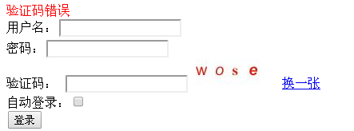

# 22. 集成验证码

在做用户登录功能时，很多时候都需要验证码支持，验证码的目的是为了防止机器人模拟真实用户登录而恶意访问，如暴力破解用户密码 / 恶意评论等。目前也有一些验证码比较简单，通过一些 OCR 工具就可以解析出来；另外还有一些验证码比较复杂（一般通过如扭曲、加线条 / 噪点等干扰）防止 OCR 工具识别；但是在中国就是人多，机器干不了的可以交给人来完成，所以在中国就有很多打码平台，人工识别验证码；因此即使比较复杂的如填字、算数等类型的验证码还是能识别的。所以验证码也不是绝对可靠的，目前比较可靠还是手机验证码，但是对于用户来说相对于验证码还是比较麻烦的。
 
对于验证码图片的生成，可以自己通过如 Java 提供的图像 API 自己去生成，也可以借助如 JCaptcha 这种开源 Java 类库生成验证码图片；JCaptcha 提供了常见的如扭曲、加噪点等干扰支持。本章代码基于《第十六章 综合实例》。  

**一、添加 JCaptcha 依赖**

```
<dependency>
    <groupId>com.octo.captcha</groupId>
    <artifactId>jcaptcha</artifactId>
    <version>2.0-alpha-1</version>
</dependency>
<dependency>
    <groupId>com.octo.captcha</groupId>
    <artifactId>jcaptcha-integration-simple-servlet</artifactId>
    <version>2.0-alpha-1</version>
    <exclusions>
        <exclusion>
            <artifactId>servlet-api</artifactId>
            <groupId>javax.servlet</groupId>
        </exclusion>
    </exclusions>
</dependency>&nbsp;
```

com.octo.captcha . jcaptcha 提供了 jcaptcha 核心；而 jcaptcha-integration-simple-servlet 提供了与 Servlet 集成。  

**二、GMailEngine**

来自 [https://code.google.com/p/musicvalley/source/browse/trunk/musicvalley/doc/springSecurity/springSecurityIII/src/main/java/com/spring/security/jcaptcha/GMailEngine.java?spec=svn447&r=447]()（目前无法访问了），仿照 JCaptcha2.0 编写类似 GMail 验证码的样式；具体请参考 com.github.zhangkaitao.shiro.chapter22.jcaptcha.GMailEngine。
 
**三、MyManageableImageCaptchaService**

提供了判断仓库中是否有相应的验证码存在。

```
public class MyManageableImageCaptchaService extends 
  DefaultManageableImageCaptchaService { 
    public MyManageableImageCaptchaService(
      com.octo.captcha.service.captchastore.CaptchaStore captchaStore,      
      com.octo.captcha.engine.CaptchaEngine captchaEngine,
      int minGuarantedStorageDelayInSeconds, 
      int maxCaptchaStoreSize, 
      int captchaStoreLoadBeforeGarbageCollection) {
        super(captchaStore, captchaEngine, minGuarantedStorageDelayInSeconds, 
            maxCaptchaStoreSize, captchaStoreLoadBeforeGarbageCollection);
    }
    public boolean hasCapcha(String id, String userCaptchaResponse) {
        return store.getCaptcha(id).validateResponse(userCaptchaResponse);
    }
}
```

**四、JCaptcha 工具类**

提供相应的 API 来验证当前请求输入的验证码是否正确。 

```
public class JCaptcha {
    public static final MyManageableImageCaptchaService captchaService
            = new MyManageableImageCaptchaService(new FastHashMapCaptchaStore(), 
                            new GMailEngine(), 180, 100000, 75000);
    public static boolean validateResponse(
        HttpServletRequest request, String userCaptchaResponse) {
        if (request.getSession(false) == null) return false;
        boolean validated = false;
        try {
            String id = request.getSession().getId();
            validated = 
                captchaService.validateResponseForID(id, userCaptchaResponse)
                            .booleanValue();
        } catch (CaptchaServiceException e) {
            e.printStackTrace();
        }
        return validated;
    } 
    public static boolean hasCaptcha(
        HttpServletRequest request, String userCaptchaResponse) {
        if (request.getSession(false) == null) return false;
        boolean validated = false;
        try {
            String id = request.getSession().getId();
            validated = captchaService.hasCapcha(id, userCaptchaResponse);
        } catch (CaptchaServiceException e) {
            e.printStackTrace();
        }
        return validated;
    }
}&nbsp;
```

validateResponse()：验证当前请求输入的验证码否正确；并从 CaptchaService 中删除已经生成的验证码；
hasCaptcha()：验证当前请求输入的验证码是否正确；但不从 CaptchaService 中删除已经生成的验证码（比如 Ajax 验证时可以使用，防止多次生成验证码）；  

**五、JCaptchaFilter**

用于生成验证码图片的过滤器。

```
public class JCaptchaFilter extends OncePerRequestFilter {
    protected void doFilterInternal(HttpServletRequest request, HttpServletResponse response, FilterChain filterChain) throws ServletException, IOException {
        response.setDateHeader("Expires", 0L);
        response.setHeader("Cache-Control", "no-store, no-cache, must-revalidate");
        response.addHeader("Cache-Control", "post-check=0, pre-check=0");
        response.setHeader("Pragma", "no-cache");
        response.setContentType("image/jpeg");
        String id = request.getRequestedSessionId();
        BufferedImage bi = JCaptcha.captchaService.getImageChallengeForID(id);
        ServletOutputStream out = response.getOutputStream();
        ImageIO.write(bi, "jpg", out);
        try {
            out.flush();
        } finally {
            out.close();
        }
    }
}&nbsp;
```

CaptchaService 使用当前会话 ID 当作 key 获取相应的验证码图片；另外需要设置响应内容不进行浏览器端缓存。  

```
<filter>
  <filter-name>JCaptchaFilter</filter-name>
  <filter-class> 
    com.github.zhangkaitao.shiro.chapter22.jcaptcha.JCaptchaFilter
  </filter-class>
  </filter>
  <filter-mapping>
    <filter-name>JCaptchaFilter</filter-name>
    <url-pattern>/jcaptcha.jpg</url-pattern>
</filter-mapping>&nbsp;
```

这样就可以在页面使用 / jcaptcha.jpg 地址显示验证码图片。  

**六、JCaptchaValidateFilter**

用于验证码验证的 Shiro 过滤器。

```
public class JCaptchaValidateFilter extends AccessControlFilter {
    private boolean jcaptchaEbabled = true;//是否开启验证码支持
    private String jcaptchaParam = "jcaptchaCode";//前台提交的验证码参数名
    private String failureKeyAttribute = "shiroLoginFailure"; //验证失败后存储到的属性名
    public void setJcaptchaEbabled(boolean jcaptchaEbabled) {
        this.jcaptchaEbabled = jcaptchaEbabled;
    }
    public void setJcaptchaParam(String jcaptchaParam) {
        this.jcaptchaParam = jcaptchaParam;
    }
    public void setFailureKeyAttribute(String failureKeyAttribute) {
        this.failureKeyAttribute = failureKeyAttribute;
    }
    protected boolean isAccessAllowed(ServletRequest request, ServletResponse response, Object mappedValue) throws Exception {
        //1、设置验证码是否开启属性，页面可以根据该属性来决定是否显示验证码
        request.setAttribute("jcaptchaEbabled", jcaptchaEbabled);
        HttpServletRequest httpServletRequest = WebUtils.toHttp(request);
        //2、判断验证码是否禁用 或不是表单提交（允许访问）
        if (jcaptchaEbabled == false || !"post".equalsIgnoreCase(httpServletRequest.getMethod())) {
            return true;
        }
        //3、此时是表单提交，验证验证码是否正确
        return JCaptcha.validateResponse(httpServletRequest, httpServletRequest.getParameter(jcaptchaParam));
    }
    protected boolean onAccessDenied(ServletRequest request, ServletResponse response) throws Exception {
        //如果验证码失败了，存储失败key属性
        request.setAttribute(failureKeyAttribute, "jCaptcha.error");
        return true;
    }
}
```

**七、MyFormAuthenticationFilter**

用于验证码验证的 Shiro 拦截器在用于身份认证的拦截器之前运行；但是如果验证码验证拦截器失败了，就不需要进行身份认证拦截器流程了；所以需要修改下如 FormAuthenticationFilter 身份认证拦截器，当验证码验证失败时不再走身份认证拦截器。  

```
public class MyFormAuthenticationFilter extends FormAuthenticationFilter {
    protected boolean onAccessDenied(ServletRequest request, ServletResponse response, Object mappedValue) throws Exception {
        if(request.getAttribute(getFailureKeyAttribute()) != null) {
            return true;
        }
        return super.onAccessDenied(request, response, mappedValue);
    }
}&nbsp;
```

即如果之前已经错了，那直接跳过即可。  

**八、spring-config-shiro.xml**

```
<bean id="authcFilter" class="com.github.zhangkaitao.shiro.chapter22.jcaptcha.MyFormAuthenticationFilter">
    <property name="usernameParam" value="username"/>
    <property name="passwordParam" value="password"/>
    <property name="rememberMeParam" value="rememberMe"/>
    <property name="failureKeyAttribute" value="shiroLoginFailure"/>
</bean>
<bean id="jCaptchaValidateFilter" 
  class="com.github.zhangkaitao.shiro.chapter22.jcaptcha.JCaptchaValidateFilter">
    <property name="jcaptchaEbabled" value="true"/>
    <property name="jcaptchaParam" value="jcaptchaCode"/>
    <property name="failureKeyAttribute" value="shiroLoginFailure"/>
</bean>
<bean id="shiroFilter" class="org.apache.shiro.spring.web.ShiroFilterFactoryBean">
    <property name="securityManager" ref="securityManager"/>
    <property name="loginUrl" value="/login"/>
    <property name="filters">
        <util:map>
            <entry key="authc" value-ref="authcFilter"/>
            <entry key="sysUser" value-ref="sysUserFilter"/>
            <entry key="jCaptchaValidate" value-ref="jCaptchaValidateFilter"/>
        </util:map>
    </property>
    <property name="filterChainDefinitions">
        <value>
            /static/** = anon
            /jcaptcha* = anon
            /login = jCaptchaValidate,authc
            /logout = logout
            /authenticated = authc
            /** = user,sysUser
        </value>
    </property>
</bean>
```
  
**九、login.jsp 登录页面**

```
<c:if test="${jcaptchaEbabled}">
    验证码：
    <input type="text" name="jcaptchaCode">

    <a class="jcaptcha-btn" href="javascript:;">换一张</a>
    <br/>
</c:if>&nbsp;
```

根据 jcaptchaEbabled 来显示验证码图片。  

**十、测试**

输入 [http://localhost:8080/chapter22](http://localhost:8080/chapter22) 将重定向到登录页面；输入正确的用户名 / 密码 / 验证码即可成功登录，如果输入错误的验证码，将显示验证码错误页面：  




