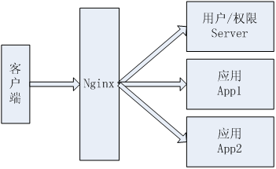
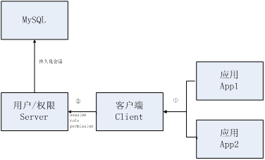
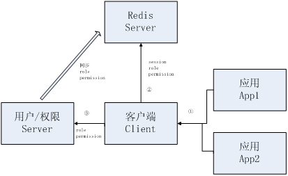
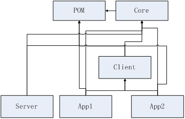
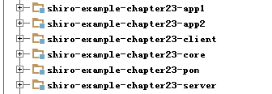
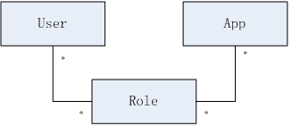
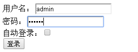
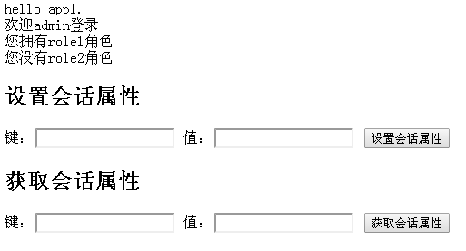
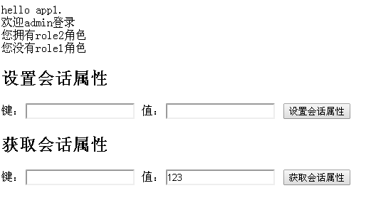

# 23. 多项目集中权限管理及分布式会话

在做一些企业内部项目时或一些互联网后台时；可能会涉及到集中权限管理，统一进行多项目的权限管理；另外也需要统一的会话管理，即实现单点身份认证和授权控制。
 
学习本章之前，请务必先学习《第十章 会话管理》和《第十六章 综合实例》，本章代码都是基于这两章的代码基础上完成的。
 
本章示例是同域名的场景下完成的，如果跨域请参考《第十五章 单点登录》和《第十七章 OAuth2 集成》了解使用 CAS 或 OAuth2 实现跨域的身份验证和授权。另外比如客户端 / 服务器端的安全校验可参考《第二十章 无状态 Web 应用集成》。  

## 部署架构 



1. 有三个应用：用于用户 / 权限控制的 Server（端口：8080）；两个应用 App1（端口 9080）和 App2（端口 10080）；
2. 使用 Nginx 反向代理这三个应用，nginx.conf 的 server 配置部分如下： 

```
server {
    listen 80;
    server_name  localhost;
    charset utf-8;
    location ~ ^/(chapter23-server)/ {
	    proxy_pass http://127.0.0.1:8080; 
	    index /;
            proxy_set_header Host $host;
    }
    location ~ ^/(chapter23-app1)/ {
	    proxy_pass http://127.0.0.1:9080; 
	    index /;
            proxy_set_header Host $host;
    }
    location ~ ^/(chapter23-app2)/ {
	    proxy_pass http://127.0.0.1:10080; 
	    index /;
            proxy_set_header Host $host;
    }
}&nbsp;
```

如访问 [http://localhost/chapter23-server](http://localhost/chapter23-server) 会自动转发到 [http://localhost:8080/chapter23-server](http://localhost:8080/chapter23-server)；  
访问 [http://localhost/chapter23-app1](http://localhost/chapter23-app1) 会自动转发到 [http://localhost:9080/chapter23-app1](http://localhost:9080/chapter23-app1)；  
访问 [http://localhost/chapter23-app3](http://localhost/chapter23-app3) 会自动转发到 [http://localhost:10080/chapter23-app3](http://localhost:10080/chapter23-app3)；  
 
Nginx 的安装及使用请自行搜索学习，本文不再阐述。 

## 项目架构



1. 首先通过用户 / 权限 Server 维护用户、应用、权限信息；数据都持久化到 MySQL 数据库中；
2. 应用 App1 / 应用 App2 使用客户端 Client 远程调用用户 / 权限 Server 获取会话及权限信息。  
 
此处使用 Mysql 存储会话，而不是使用如 Memcached/Redis 之类的，主要目的是降低学习成本；如果换成如 Redis 也不会很难；如：  



使用如 Redis 还一个好处就是无需在用户 / 权限 Server 中开会话过期调度器，可以借助 Redis 自身的过期策略来完成。

## 模块关系依赖





1、shiro-example-chapter23-pom 模块：提供了其他所有模块的依赖；这样其他模块直接继承它即可，简化依赖配置，如 shiro-example-chapter23-server：  

```
<parent>
    <artifactId>shiro-example-chapter23-pom</artifactId>
    <groupId>com.github.zhangkaitao</groupId>
    <version>1.0-SNAPSHOT</version>
</parent>
```

2、shiro-example-chapter23-core 模块：提供给 shiro-example-chapter23-server、shiro-example-chapter23-client、shiro-example-chapter23-app * 模块的核心依赖，比如远程调用接口等；
  
3、shiro-example-chapter23-server 模块：提供了用户、应用、权限管理功能；
 
4、shiro-example-chapter23-client 模块：提供给应用模块获取会话及应用对应的权限信息；
 
5、shiro-example-chapter23-app * 模块：各个子应用，如一些内部管理系统应用；其登录都跳到 shiro-example-chapter23-server 登录；另外权限都从 shiro-example-chapter23-server 获取（如通过远程调用）。  

## shiro-example-chapter23-pom 模块
 
其 pom.xml 的 packaging 类型为 pom，并且在该 pom 中加入其他模块需要的依赖，然后其他模块只需要把该模块设置为 parent 即可自动继承这些依赖，如 shiro-example-chapter23-server 模块：  

```
<parent>
    <artifactId>shiro-example-chapter23-pom</artifactId>
    <groupId>com.github.zhangkaitao</groupId>
    <version>1.0-SNAPSHOT</version>
</parent>&nbsp;
```

简化其他模块的依赖配置等。

## shiro-example-chapter23-core 模块
 
提供了其他模块共有的依赖，如远程调用接口：  

```
public interface RemoteServiceInterface {
    public Session getSession(String appKey, Serializable sessionId);
    Serializable createSession(Session session);
    public void updateSession(String appKey, Session session);
    public void deleteSession(String appKey, Session session);
    public PermissionContext getPermissions(String appKey, String username);
}&nbsp;
```

提供了会话的 CRUD，及根据应用 key 和用户名获取权限上下文（包括角色和权限字符串）；shiro-example-chapter23-server 模块服务端实现；shiro-example-chapter23-client 模块客户端调用。  
 
另外提供了 com.github.zhangkaitao.shiro.chapter23.core.ClientSavedRequest，其扩展了 org.apache.shiro.web.util.SavedRequest；用于 shiro-example-chapter23-app * 模块当访问一些需要登录的请求时，自动把请求保存下来，然后重定向到 shiro-example-chapter23-server 模块登录；登录成功后再重定向回来；因为 SavedRequest 不保存 URL 中的 [schema://domain:port]() 部分；所以才需要扩展 SavedRequest；使得 ClientSavedRequest 能保存 [schema://domain:port]()；这样才能从一个应用重定向另一个（要不然只能在一个应用内重定向）：

```
    public String getRequestUrl() {
        String requestURI = getRequestURI();
        if(backUrl != null) {//1
            if(backUrl.toLowerCase().startsWith("http://") || backUrl.toLowerCase().startsWith("https://")) {
                return backUrl;
            } else if(!backUrl.startsWith(contextPath)) {//2
                requestURI = contextPath + backUrl;
            } else {//3
                requestURI = backUrl;
            }
        }
        StringBuilder requestUrl = new StringBuilder(scheme);//4
        requestUrl.append("://");
        requestUrl.append(domain);//5
        //6
        if("http".equalsIgnoreCase(scheme) && port != 80) {
            requestUrl.append(":").append(String.valueOf(port));
        } else if("https".equalsIgnoreCase(scheme) && port != 443) {
            requestUrl.append(":").append(String.valueOf(port));
        }
        //7
        requestUrl.append(requestURI);
        //8
        if (backUrl == null && getQueryString() != null) {
            requestUrl.append("?").append(getQueryString());
        }
        return requestUrl.toString();
    }
&nbsp;
```

1. 如果从外部传入了 successUrl（登录成功之后重定向的地址），且以 http:// 或 https:// 开头那么直接返回（相应的拦截器直接重定向到它即可）；
2. 如果 successUrl 有值但没有上下文，拼上上下文；
3. 否则，如果 successUrl 有值，直接赋值给 requestUrl 即可；否则，如果 successUrl 没值，那么 requestUrl 就是当前请求的地址；
4. 拼上 url 前边的 schema，如 http 或 https；
5. 拼上域名；
6. 拼上重定向到的地址（带上下文）；
7. 如果 successUrl 没值，且有查询参数，拼上；
8. 返回该地址，相应的拦截器直接重定向到它即可。

## shiro-example-chapter23-server 模块

**简单的实体关系图**



**简单数据字典**

用户 (sys_user) 
<table border="1" style="border-collapse: collapse; border: none;" class="MsoNormalTable" cellpadding="0" cellspacing="0">
<tbody><tr>
<td>
<p class="MsoNormal">名称</p>
</td>
<td >
<p class="MsoNormal">类型</p>
</td>
<td>
<p class="MsoNormal">长度</p>
</td>
<td>
<p class="MsoNormal">描述</p>
</td>
</tr>
<tr>
<td>
<p class="MsoNormal">id</p>
</td>
<td>
<p class="MsoNormal">bigint</p>
</td>
<td >
<p class="MsoNormal">&nbsp;</p>
</td>
<td >
<p class="MsoNormal">编号 主键</p>
</td>
</tr>
<tr>
<td >
<p class="MsoNormal">username</p>
</td>
<td >
<p class="MsoNormal">varchar</p>
</td>
<td >
<p class="MsoNormal">100</p>
</td>
<td>
<p class="MsoNormal">用户名</p>
</td>
</tr>
<tr>
<td>
<p class="MsoNormal">password</p>
</td>
<td >
<p class="MsoNormal">varchar</p>
</td>
<td >
<p class="MsoNormal">100</p>
</td>
<td >
<p class="MsoNormal">密码</p>
</td>
</tr>
<tr>
<td >
<p class="MsoNormal">salt</p>
</td>
<td >
<p class="MsoNormal">varchar</p>
</td>
<td >
<p class="MsoNormal">50</p>
</td>
<td >
<p class="MsoNormal">盐</p>
</td>
</tr>
<tr>
<td >
<p class="MsoNormal">locked</p>
</td>
<td >
<p class="MsoNormal">bool</p>
</td>
<td
<p class="MsoNormal">&nbsp;</p>
</td>
<td >
<p class="MsoNormal">账户是否锁定</p>
</td>
</tr>
</tbody></table>
 
应用 (sys_app)
<table border="1" style="border-collapse: collapse; border: none;" class="MsoNormalTable" cellpadding="0" cellspacing="0">
<tbody><tr>
<td >
<p class="MsoNormal">名称</p>
</td>
<td >
<p class="MsoNormal">类型</p>
</td>
<td >
<p class="MsoNormal">长度</p>
</td>
<td >
<p class="MsoNormal">描述</p>
</td>
</tr>
<tr>
<td >
<p class="MsoNormal">id</p>
</td>
<td >
<p class="MsoNormal">bigint</p>
</td>
<td >
<p class="MsoNormal">&nbsp;</p>
</td>
<td >
<p class="MsoNormal">编号 主键</p>
</td>
</tr>
<tr>
<td>
<p class="MsoNormal">name</p>
</td>
<td >
<p class="MsoNormal">varchar</p>
</td>
<td >
<p class="MsoNormal">100</p>
</td>
<td >
<p class="MsoNormal">应用名称</p>
</td>
</tr>
<tr>
<td >
<p class="MsoNormal">app_key</p>
</td>
<td >
<p class="MsoNormal">varchar</p>
</td>
<td >
<p class="MsoNormal">100</p>
</td>
<td>
<p class="MsoNormal">应用 key（唯一）</p>
</td>
</tr>
<tr>
<td >
<p class="MsoNormal">app_secret</p>
</td>
<td >
<p class="MsoNormal">varchar</p>
</td>
<td >
<p class="MsoNormal">100</p>
</td>
<td >
<p class="MsoNormal">应用安全码</p>
</td>
</tr>
<tr>
<td >
<p class="MsoNormal">available</p>
</td>
<td>
<p class="MsoNormal">bool</p>
</td>
<td>
<p class="MsoNormal">&nbsp;</p>
</td>
<td >
<p class="MsoNormal">是否锁定</p>
</td>
</tr>
</tbody></table>

授权 (sys_authorization)
<table border="1" style="border-collapse: collapse; border: none;" class="MsoNormalTable" cellpadding="0" cellspacing="0">
<tbody><tr>
<td>
<p class="MsoNormal">名称</p>
</td>
<td>
<p class="MsoNormal">类型</p>
</td>
<td>
<p class="MsoNormal">长度</p>
</td>
<td>
<p class="MsoNormal">描述</p>
</td>
</tr>
<tr>
<td>
<p class="MsoNormal">id</p>
</td>
<td>
<p class="MsoNormal">bigint</p>
</td>
<td>
<p class="MsoNormal">&nbsp;</p>
</td>
<td>
<p class="MsoNormal">编号 主键</p>
</td>
</tr>
<tr>
<td>
<p class="MsoNormal">user_id</p>
</td>
<td>
<p class="MsoNormal">bigint</p>
</td>
<td>
<p class="MsoNormal">&nbsp;</p>
</td>
<td>
<p class="MsoNormal">所属用户</p>
</td>
</tr>
<tr>
<td>
<p class="MsoNormal">app_id</p>
</td>
<td>
<p class="MsoNormal">bigint</p>
</td>
<td>
<p class="MsoNormal">&nbsp;</p>
</td>
<td>
<p class="MsoNormal">所属应用</p>
</td>
</tr>
<tr>
<td>
<p class="MsoNormal">role_ids</p>
</td>
<td>
<p class="MsoNormal">varchar</p>
</td>
<td>
<p class="MsoNormal">100</p>
</td>
<td>
<p class="MsoNormal">角色列表</p>
</td>
</tr>
</tbody></table>

**用户**：比《第十六章 综合实例》少了 role_ids，因为本章是多项目集中权限管理；所以授权时需要指定相应的应用；而不是直接给用户授权；所以不能在用户中出现 role_ids 了；
  
**应用**：所有集中权限的应用；在此处需要指定应用 key(app_key) 和应用安全码（app_secret），app 在访问 server 时需要指定自己的 app_key 和用户名来获取该 app 对应用户权限信息；另外 app_secret 可以认为 app 的密码，比如需要安全访问时可以考虑使用它，可参考《第二十章 无状态 Web 应用集成》。另外 available 属性表示该应用当前是否开启；如果 false 表示该应用当前不可用，即不能获取到相应的权限信息。
  
**授权**：给指定的用户在指定的 app 下授权，即角色是与用户和 app 存在关联关系。
 
因为本章使用了《第十六章 综合实例》代码，所以还有其他相应的表结构（本章未使用到）。

**表 / 数据 SQL**

具体请参考
sql/ shiro-schema.sql （表结构）  
sql/ shiro-data.sql  （初始数据）  
 
**实体**

具体请参考 com.github.zhangkaitao.shiro.chapter23.entity 包下的实体，此处就不列举了。
 
**DAO**

具体请参考 com.github.zhangkaitao.shiro.chapter23.dao 包下的 DAO 接口及实现。
 
**Service**

具体请参考 com.github.zhangkaitao.shiro.chapter23.service 包下的 Service 接口及实现。以下是出了基本 CRUD 之外的关键接口：

```
public interface AppService {
    public Long findAppIdByAppKey(String appKey);// 根据appKey查找AppId 
}
```

```
public interface AuthorizationService {
    //根据AppKey和用户名查找其角色
    public Set<String> findRoles(String appKey, String username);
    //根据AppKey和用户名查找权限字符串
    public Set<String> findPermissions(String appKey, String username);
}&nbsp;
```

根据 AppKey 和用户名查找用户在指定应用中对于的角色和权限字符串。  

**UserRealm**

```
protected AuthorizationInfo doGetAuthorizationInfo(PrincipalCollection principals) {
    String username = (String)principals.getPrimaryPrincipal();
    SimpleAuthorizationInfo authorizationInfo = new SimpleAuthorizationInfo();
    authorizationInfo.setRoles(
        authorizationService.findRoles(Constants.SERVER_APP_KEY, username));
    authorizationInfo.setStringPermissions(
    authorizationService.findPermissions(Constants.SERVER_APP_KEY, username));
    return authorizationInfo;
}&nbsp;
```

此处需要调用 AuthorizationService 的 findRoles/findPermissions 方法传入 AppKey 和用户名来获取用户的角色和权限字符串集合。其他的和《第十六章 综合实例》代码一样。  

**ServerFormAuthenticationFilter**

```
public class ServerFormAuthenticationFilter extends FormAuthenticationFilter {
    protected void issueSuccessRedirect(ServletRequest request, ServletResponse response) throws Exception {
        String fallbackUrl = (String) getSubject(request, response)
                .getSession().getAttribute("authc.fallbackUrl");
        if(StringUtils.isEmpty(fallbackUrl)) {
            fallbackUrl = getSuccessUrl();
        }
        WebUtils.redirectToSavedRequest(request, response, fallbackUrl);
    }
}&nbsp;
```

因为是多项目登录，比如如果是从其他应用中重定向过来的，首先检查 Session 中是否有 “authc.fallbackUrl” 属性，如果有就认为它是默认的重定向地址；否则使用 Server 自己的 successUrl 作为登录成功后重定向到的地址。
 
**MySqlSessionDAO**

将会话持久化到 Mysql 数据库；此处大家可以将其实现为如存储到 Redis/Memcached 等，实现策略请参考《第十章 会话管理》中的会话存储 / 持久化章节的 MySessionDAO，完全一样。
 
**MySqlSessionValidationScheduler**

和《第十章 会话管理》中的会话验证章节部分中的 MySessionValidationScheduler 完全一样。如果使用如 Redis 之类的有自动过期策略的 DB，完全可以不用实现 SessionValidationScheduler，直接借助于这些 DB 的过期策略即可。

**RemoteService**

```
public class RemoteService implements RemoteServiceInterface {
    @Autowired  private AuthorizationService authorizationService;
    @Autowired  private SessionDAO sessionDAO;
    public Session getSession(String appKey, Serializable sessionId) {
        return sessionDAO.readSession(sessionId);
    }
    public Serializable createSession(Session session) {
        return sessionDAO.create(session);
    }
    public void updateSession(String appKey, Session session) {
        sessionDAO.update(session);
    }
    public void deleteSession(String appKey, Session session) {
        sessionDAO.delete(session);
    }
    public PermissionContext getPermissions(String appKey, String username) {
        PermissionContext permissionContext = new PermissionContext();
        permissionContext.setRoles(authorizationService.findRoles(appKey, username));
        permissionContext.setPermissions(authorizationService.findPermissions(appKey, username));
        return permissionContext;
    }
}&nbsp;
```

将会使用 HTTP 调用器暴露为远程服务，这样其他应用就可以使用相应的客户端调用这些接口进行 Session 的集中维护及根据 AppKey 和用户名获取角色 / 权限字符串集合。此处没有实现安全校验功能，如果是局域网内使用可以通过限定 IP 完成；否则需要使用如《第二十章 无状态 Web 应用集成》中的技术完成安全校验。
 
然后在 spring-mvc-remote-service.xml 配置文件把服务暴露出去：  

```
<bean id="remoteService"
  class="com.github.zhangkaitao.shiro.chapter23.remote.RemoteService"/>
<bean name="/remoteService" 
  class="org.springframework.remoting.httpinvoker.HttpInvokerServiceExporter">
    <property name="service" ref="remoteService"/>
    <property name="serviceInterface" 
    value="com.github.zhangkaitao.shiro.chapter23.remote.RemoteServiceInterface">
</bean>
```

**Shiro 配置文件 spring-config-shiro.xml**

和《第十六章 综合实例》配置类似，但是需要在 shiroFilter 中的 filterChainDefinitions 中添加如下配置，即远程调用不需要身份认证：

`/remoteService = anon`

对于 userRealm 的缓存配置直接禁用；因为如果开启，修改了用户权限不会自动同步到缓存；另外请参考《第十一章 缓存机制》进行缓存的正确配置。

**服务器端数据维护**

1、首先开启 ngnix 反向代理；然后就可以直接访问 [http://localhost/chapter23-server/](http://localhost/chapter23-server/)；
2、输入默认的用户名密码：admin/123456 登录
3、应用管理，进行应用的 CRUD，主要维护应用 KEY（必须唯一）及应用安全码；客户端就可以使用应用 KEY 获取用户对应应用的权限了。


4、授权管理，维护在哪个应用中用户的角色列表。这样客户端就可以根据应用 KEY 及用户名获取到对应的角色 / 权限字符串列表了。


## shiro-example-chapter23-client 模块

Client 模块提供给其他应用模块依赖，这样其他应用模块只需要依赖 Client 模块，然后再在相应的配置文件中配置如登录地址、远程接口地址、拦截器链等等即可，简化其他应用模块的配置。

**配置远程服务 spring-client-remote-service.xml**

```
<bean id="remoteService" 
  class="org.springframework.remoting.httpinvoker.HttpInvokerProxyFactoryBean">
    <property name="serviceUrl" value="${client.remote.service.url}"/>
    <property name="serviceInterface" 
      value="com.github.zhangkaitao.shiro.chapter23.remote.RemoteServiceInterface"/>
</bean>&nbsp;
```

client.remote.service.url 是远程服务暴露的地址；通过相应的 properties 配置文件配置，后续介绍。然后就可以通过 remoteService 获取会话及角色 / 权限字符串集合了。  

**ClientRealm**

```
public class ClientRealm extends AuthorizingRealm {
    private RemoteServiceInterface remoteService;
    private String appKey;
    public void setRemoteService(RemoteServiceInterface remoteService) {
        this.remoteService = remoteService;
    }
    public void setAppKey(String appKey) {
        this.appKey = appKey;
    }
    protected AuthorizationInfo doGetAuthorizationInfo(PrincipalCollection principals) {
        String username = (String) principals.getPrimaryPrincipal();
        SimpleAuthorizationInfo authorizationInfo = new SimpleAuthorizationInfo();
        PermissionContext context = remoteService.getPermissions(appKey, username);
        authorizationInfo.setRoles(context.getRoles());
        authorizationInfo.setStringPermissions(context.getPermissions());
        return authorizationInfo;
    }
    protected AuthenticationInfo doGetAuthenticationInfo(AuthenticationToken token) throws AuthenticationException {
        //永远不会被调用
        throw new UnsupportedOperationException("永远不会被调用");
    }
}&nbsp;
```

ClientRealm 提供身份认证信息和授权信息，此处因为是其他应用依赖客户端，而这些应用不会实现身份认证，所以 doGetAuthenticationInfo 获取身份认证信息直接无须实现。另外获取授权信息，是通过远程暴露的服务 RemoteServiceInterface 获取，提供 appKey 和用户名获取即可。  

**ClientSessionDAO**

```
public class ClientSessionDAO extends CachingSessionDAO {
    private RemoteServiceInterface remoteService;
    private String appKey;
    public void setRemoteService(RemoteServiceInterface remoteService) {
        this.remoteService = remoteService;
    }
    public void setAppKey(String appKey) {
        this.appKey = appKey;
    }
    protected void doDelete(Session session) {
        remoteService.deleteSession(appKey, session);
    }
    protected void doUpdate(Session session) {
        remoteService.updateSession(appKey, session);
}
protected Serializable doCreate(Session session) {
        Serializable sessionId = remoteService.createSession(session);
        assignSessionId(session, sessionId);
        return sessionId;
    }
    protected Session doReadSession(Serializable sessionId) {
        return remoteService.getSession(appKey, sessionId);
    }
}&nbsp;
```

Session 的维护通过远程暴露接口实现，即本地不维护会话。  

**ClientAuthenticationFilter**

```
public class ClientAuthenticationFilter extends AuthenticationFilter {
    protected boolean isAccessAllowed(ServletRequest request, ServletResponse response, Object mappedValue) {
        Subject subject = getSubject(request, response);
        return subject.isAuthenticated();
    }
    protected boolean onAccessDenied(ServletRequest request, ServletResponse response) throws Exception {
        String backUrl = request.getParameter("backUrl");
        saveRequest(request, backUrl, getDefaultBackUrl(WebUtils.toHttp(request)));
        return false;
    }
    protected void saveRequest(ServletRequest request, String backUrl, String fallbackUrl) {
        Subject subject = SecurityUtils.getSubject();
        Session session = subject.getSession();
        HttpServletRequest httpRequest = WebUtils.toHttp(request);
        session.setAttribute("authc.fallbackUrl", fallbackUrl);
        SavedRequest savedRequest = new ClientSavedRequest(httpRequest, backUrl);
        session.setAttribute(WebUtils.SAVED_REQUEST_KEY, savedRequest);
}
    private String getDefaultBackUrl(HttpServletRequest request) {
        String scheme = request.getScheme();
        String domain = request.getServerName();
        int port = request.getServerPort();
        String contextPath = request.getContextPath();
        StringBuilder backUrl = new StringBuilder(scheme);
        backUrl.append("://");
        backUrl.append(domain);
        if("http".equalsIgnoreCase(scheme) && port != 80) {
            backUrl.append(":").append(String.valueOf(port));
        } else if("https".equalsIgnoreCase(scheme) && port != 443) {
            backUrl.append(":").append(String.valueOf(port));
        }
        backUrl.append(contextPath);
        backUrl.append(getSuccessUrl());
        return backUrl.toString();
    }
}&nbsp;
```

ClientAuthenticationFilter 是用于实现身份认证的拦截器（authc），当用户没有身份认证时；

1. 首先得到请求参数 backUrl，即登录成功重定向到的地址；
2. 然后保存保存请求到会话，并重定向到登录地址（server 模块）；
3. 登录成功后，返回地址按照如下顺序获取：backUrl、保存的当前请求地址、defaultBackUrl（即设置的 successUrl）；

**ClientShiroFilterFactoryBean**

```
public class ClientShiroFilterFactoryBean extends ShiroFilterFactoryBean implements ApplicationContextAware {
    private ApplicationContext applicationContext;
    public void setApplicationContext(ApplicationContext applicationContext) {
        this.applicationContext = applicationContext;
    }
    public void setFiltersStr(String filters) {
        if(StringUtils.isEmpty(filters)) {
            return;
        }
        String[] filterArray = filters.split(";");
        for(String filter : filterArray) {
            String[] o = filter.split("=");
            getFilters().put(o[0], (Filter)applicationContext.getBean(o[1]));
        }
    }
    public void setFilterChainDefinitionsStr(String filterChainDefinitions) {
        if(StringUtils.isEmpty(filterChainDefinitions)) {
            return;
        }
        String[] chainDefinitionsArray = filterChainDefinitions.split(";");
        for(String filter : chainDefinitionsArray) {
            String[] o = filter.split("=");
            getFilterChainDefinitionMap().put(o[0], o[1]);
        }
    }
}&nbsp;
```

1. setFiltersStr：设置拦截器，设置格式如 “filterName=filterBeanName; filterName=filterBeanName”；多个之间分号分隔；然后通过 applicationContext 获取 filterBeanName 对应的 Bean 注册到拦截器 Map 中；
2. setFilterChainDefinitionsStr：设置拦截器链，设置格式如 “url=filterName1[config],filterName2; url=filterName1[config],filterName2”；多个之间分号分隔；

**Shiro 客户端配置 spring-client.xml**

提供了各应用通用的 Shiro 客户端配置；这样应用只需要导入相应该配置即可完成 Shiro 的配置，简化了整个配置过程。

```
<context:property-placeholder location= 
    "classpath:client/shiro-client-default.properties,classpath:client/shiro-client.properties"/>&nbsp;
```

提供给客户端配置的 properties 属性文件，client/shiro-client-default.properties 是客户端提供的默认的配置；classpath:client/shiro-client.properties 是用于覆盖客户端默认配置，各应用应该提供该配置文件，然后提供各应用个性配置。  

```
<bean id="remoteRealm" class="com.github.zhangkaitao.shiro.chapter23.client.ClientRealm">
    <property name="cachingEnabled" value="false"/>
    <property name="appKey" value="${client.app.key}"/>
    <property name="remoteService" ref="remoteService"/>
</bean>&nbsp;
```

appKey：使用 ${client.app.key} 占位符替换，即需要在之前的 properties 文件中配置。

```
<bean id="sessionIdCookie" class="org.apache.shiro.web.servlet.SimpleCookie">
    <constructor-arg value="${client.session.id}"/>
    <property name="httpOnly" value="true"/>
    <property name="maxAge" value="-1"/>
    <property name="domain" value="${client.cookie.domain}"/>
    <property name="path" value="${client.cookie.path}"/>
</bean>&nbsp;
```

Session Id Cookie，cookie 名字、域名、路径等都是通过配置文件配置。  

```
<bean id="sessionDAO" 
  class="com.github.zhangkaitao.shiro.chapter23.client.ClientSessionDAO">
    <property name="sessionIdGenerator" ref="sessionIdGenerator"/>
    <property name="appKey" value="${client.app.key}"/>
    <property name="remoteService" ref="remoteService"/>
</bean>&nbsp;
```

SessionDAO 的 appKey，也是通过 ${client.app.key} 占位符替换，需要在配置文件配置。  

```
<bean id="sessionManager" 
  class="org.apache.shiro.web.session.mgt.DefaultWebSessionManager">
        <property name="sessionValidationSchedulerEnabled" value="false"/>//省略其他
</bean>&nbsp;
```

其他应用无须进行会话过期调度，所以 sessionValidationSchedulerEnabled=false。  

```
<bean id="clientAuthenticationFilter" 
  class="com.github.zhangkaitao.shiro.chapter23.client.ClientAuthenticationFilter"/>&nbsp;
```

其他应用无须进行会话过期调度，所以 sessionValidationSchedulerEnabled=false。  

```
<bean id="clientAuthenticationFilter" 
class="com.github.zhangkaitao.shiro.chapter23.client.ClientAuthenticationFilter"/>&nbsp;
```

应用的身份认证使用 ClientAuthenticationFilter，即如果没有身份认证，则会重定向到 Server 模块完成身份认证，身份认证成功后再重定向回来。 

```
<bean id="shiroFilter" 
  class="com.github.zhangkaitao.shiro.chapter23.client.ClientShiroFilterFactoryBean">
    <property name="securityManager" ref="securityManager"/>
    <property name="loginUrl" value="${client.login.url}"/>
    <property name="successUrl" value="${client.success.url}"/>
    <property name="unauthorizedUrl" value="${client.unauthorized.url}"/>
    <property name="filters">
        <util:map>
            <entry key="authc" value-ref="clientAuthenticationFilter"/>
        </util:map>
    </property>
    <property name="filtersStr" value="${client.filters}"/>
    <property name="filterChainDefinitionsStr" value="${client.filter.chain.definitions}"/>
</bean>&nbsp;
```

ShiroFilter 使用我们自定义的 ClientShiroFilterFactoryBean，然后 loginUrl（登录地址）、successUrl（登录成功后默认的重定向地址）、unauthorizedUrl（未授权重定向到的地址）通过占位符替换方式配置；另外 filtersStr 和 filterChainDefinitionsStr 也是使用占位符替换方式配置；这样就可以在各应用进行自定义了。
 
**默认配置 client/ shiro-client-default.properties**

```
\#各应用的appKey
client.app.key=
\#远程服务URL地址
client.remote.service.url=http://localhost/chapter23-server/remoteService
\#登录地址
client.login.url=http://localhost/chapter23-server/login
\#登录成功后，默认重定向到的地址
client.success.url=/
\#未授权重定向到的地址
client.unauthorized.url=http://localhost/chapter23-server/unauthorized
\#session id 域名
client.cookie.domain=
\#session id 路径
client.cookie.path=/
\#cookie中的session id名称
client.session.id=sid
\#cookie中的remember me名称
client.rememberMe.id=rememberMe
\#过滤器 name=filter-ref;name=filter-ref
client.filters=
\#过滤器链 格式 url=filters;url=filters
client.filter.chain.definitions=/**=anon&nbsp;
```

在各应用中主要配置 client.app.key、client.filters、client.filter.chain.definitions。

## shiro-example-chapter23-app * 模块

继承 shiro-example-chapter23-pom 模块 

```
<parent>
    <artifactId>shiro-example-chapter23-pom</artifactId>
    <groupId>com.github.zhangkaitao</groupId>
    <version>1.0-SNAPSHOT</version>
</parent>
```

**依赖 shiro-example-chapter23-client 模块**

```
<dependency>
    <groupId>com.github.zhangkaitao</groupId>
    <artifactId>shiro-example-chapter23-client</artifactId>
    <version>1.0-SNAPSHOT</version>
</dependency>
```

**客户端配置 client/shiro-client.properties**
 
**配置 shiro-example-chapter23-app1**

```
client.app.key=645ba612-370a-43a8-a8e0-993e7a590cf0
client.success.url=/hello
client.filter.chain.definitions=/hello=anon;/login=authc;/**=authc&nbsp;
```

client.app.key 是 server 模块维护的，直接拷贝过来即可；client.filter.chain.definitions 定义了拦截器链；比如访问 / hello，匿名即可。

**配置 shiro-example-chapter23-app2**

```
client.app.key=645ba613-370a-43a8-a8e0-993e7a590cf0
client.success.url=/hello
client.filter.chain.definitions=/hello=anon;/login=authc;/**=authc&nbsp;
```

和 app1 类似，client.app.key 是 server 模块维护的，直接拷贝过来即可；client.filter.chain.definitions 定义了拦截器链；比如访问 / hello，匿名即可。  

**web.xml**

```
<context-param>
    <param-name>contextConfigLocation</param-name>
    <param-value>
        classpath:client/spring-client.xml
    </param-value>
</context-param>
<listener>
    <listener-class>
        org.springframework.web.context.ContextLoaderListener
    </listener-class>
</listener>&nbsp;
```

指定加载客户端 Shiro 配置，client/spring-client.xml。  

```
<filter>
    <filter-name>shiroFilter</filter-name>
    <filter-class>org.springframework.web.filter.DelegatingFilterProxy</filter-class>
    <init-param>
        <param-name>targetFilterLifecycle</param-name>
        <param-value>true</param-value>
    </init-param>
</filter>
<filter-mapping>
    <filter-name>shiroFilter</filter-name>
    <url-pattern>/*</url-pattern>
</filter-mapping>
```

配置 ShiroFilter 拦截器。  

**控制器**

shiro-example-chapter23-app1

```
@Controller
public class HelloController {
    @RequestMapping("/hello")
    public String hello() {
        return "success";
    }
    @RequestMapping(value = "/attr", method = RequestMethod.POST)
    public String setAttr(
            @RequestParam("key") String key, @RequestParam("value") String value) {
        SecurityUtils.getSubject().getSession().setAttribute(key, value);
        return "success";
    }
    @RequestMapping(value = "/attr", method = RequestMethod.GET)
    public String getAttr(
            @RequestParam("key") String key, Model model) {
        model.addAttribute("value", 
            SecurityUtils.getSubject().getSession().getAttribute(key));
        return "success";
    }
    @RequestMapping("/role1")
    @RequiresRoles("role1")
    public String role1() {
        return "success";
    }
}&nbsp;
```

shiro-example-chapter23-app2 的控制器类似，role2 方法使用 @RequiresRoles("role2") 注解，即需要角色 2。
 
其他配置请参考源码。  

## 测试

**1、安装配置启动 nginx** 
 
1、首先到 http://nginx.org/en/download.html 下载，比如我下载的是 windows 版本的；
 
2、然后编辑 conf/nginx.conf 配置文件，在 server 部分添加如下部分：

```
    location ~ ^/(chapter23-server)/ {
	    proxy_pass http://127.0.0.1:8080; 
	    index /;
            proxy_set_header Host $host;
    }
    location ~ ^/(chapter23-app1)/ {
	    proxy_pass http://127.0.0.1:9080; 
	    index /;
            proxy_set_header Host $host;
    }
    location ~ ^/(chapter23-app2)/ {
	    proxy_pass http://127.0.0.1:10080; 
	    index /;
            proxy_set_header Host $host;
    }
```

3、最后双击 nginx.exe 启动 Nginx 即可。
 
已经配置好的 nginx 请到 shiro-example-chapter23-nginx 模块下下周 nginx-1.5.11.rar 即可。  

**2、安装依赖**

1、首先安装 shiro-example-chapter23-core 依赖，到 shiro-example-chapter23-core 模块下运行 mvn install 安装 core 模块。  

2、接着到 shiro-example-chapter23-client 模块下运行 mvn install 安装客户端模块。

**3、启动 Server 模块**

到 shiro-example-chapter23-server 模块下运行 mvn jetty:run 启动该模块；使用 [http://localhost:8080/chapter23-server/](http://localhost:8080/chapter23-server/) 即可访问，因为启动了 nginx，那么可以直接访问 [http://localhost/chapter23-server/](http://localhost/chapter23-server/)。

**4、启动 App\* 模块**

到 shiro-example-chapter23-app1 和 shiro-example-chapter23-app2 模块下分别运行 mvn jetty:run 启动该模块；使用 [http://localhost:9080/chapter23-app1/]() 和 [http://localhost:10080/chapter23-app2/]() 即可访问，因为启动了 nginx，那么可以直接访问 [http://localhost/chapter23-app1/](http://localhost/chapter23-app1/) 和 [http://localhost/chapter23-app2/](http://localhost/chapter23-app2/)。

**5、服务器端维护**

1、访问 http://localhost/chapter23-server/；

2、输入默认的用户名密码：admin/123456 登录

3、应用管理，进行应用的 CRUD，主要维护应用 KEY（必须唯一）及应用安全码；客户端就可以使用应用 KEY 获取用户对应应用的权限了。


4、授权管理，维护在哪个应用中用户的角色列表。这样客户端就可以根据应用 KEY 及用户名获取到对应的角色 / 权限字符串列表了。


**6、App* 模块身份认证及授权**

1、在未登录情况下访问 [http://localhost/chapter23-app1/hello](http://localhost/chapter23-app1/hello)，看到下图：


2、登录地址是 [http://localhost/chapter23-app1/login?backUrl=/chapter23-app1](http://localhost/chapter23-app1/login?backUrl=/chapter23-app1)，即登录成功后重定向回 [http://localhost/chapter23-app1](http://localhost/chapter23-app1)（这是个错误地址，为了测试登录成功后重定向地址），点击登录按钮后重定向到 Server 模块的登录界面：



3、登录成功后，会重定向到相应的登录成功地址；接着访问 [http://localhost/chapter23-app1/hello](http://localhost/chapter23-app1/hello)，看到如下图：  



4、可以看到 admin 登录，及其是否拥有 role1/role2 角色；可以在 server 模块移除 role1 角色或添加 role2 角色看看页面变化；
 
5、可以在 [http://localhost/chapter23-app1/hello](http://localhost/chapter23-app1/hello) 页面设置属性，如 key=123；接着访问 [http://localhost/chapter23-app2/attr?key=key](http://localhost/chapter23-app2/attr?key=key) 就可以看到刚才设置的属性，如下图：



另外在 app2，用户默认拥有 role2 角色，而没有 role1 角色。
 
到此整个测试就完成了，可以看出本示例实现了：会话的分布式及权限的集中管理。

## 本示例缺点

1. 没有加缓存；
2. 客户端每次获取会话 / 权限都需要通过客户端访问服务端；造成服务端单点和请求压力大；单点可以考虑使用集群来解决；请求压力大需要考虑配合缓存服务器（如 Redis）来解决；即每次会话 / 权限获取时首先查询缓存中是否存在，如果有直接获取即可；否则再查服务端；降低请求压力；
3. 会话的每次更新（比如设置属性 / 更新最后访问时间戳）都需要同步到服务端；也造成了请求压力过大；可以考虑在请求的最后只同步一次会话（需要对 Shiro 会话进行改造，通过如拦截器在执行完请求后完成同步，这样每次请求只同步一次）；
4. 只能同域名才能使用，即会话 ID 是从同一个域名下获取，如果跨域请考虑使用 CAS/OAuth2 之实现。
 
所以实际应用时可能还是需要改造的，但大体思路是差不多的。


 
