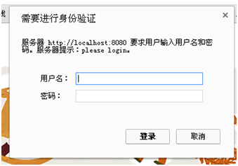

# 7. 与 Web 集成  

Shiro 提供了与 Web 集成的支持，其通过一个 ShiroFilter 入口来拦截需要安全控制的 URL，然后进行相应的控制，ShiroFilter 类似于如 Strut2/SpringMVC 这种 web 框架的前端控制器，其是安全控制的入口点，其负责读取配置（如 ini 配置文件），然后判断 URL 是否需要登录 / 权限等工作。  

## 7.1 准备环境  

**1、创建 webapp 应用**
 
此处我们使用了 jetty-maven-plugin 和 tomcat7-maven-plugin 插件；这样可以直接使用 “mvn jetty:run” 或“mvn tomcat7:run”直接运行 webapp 了。然后通过 URLhttp://localhost:8080/chapter7 / 访问即可。
 
**2、依赖**
 
Servlet3

```
<dependency>
    <groupId>javax.servlet</groupId>
    <artifactId>javax.servlet-api</artifactId>
    <version>3.0.1</version>
    <scope>provided</scope>
</dependency>&nbsp;
```

Servlet3 的知识可以参考 [https://github.com/zhangkaitao/servlet3-showcase](https://github.com/zhangkaitao/servlet3-showcase) 及 Servlet3 规范 [http://www.iteye.com/blogs/subjects/Servlet-3-1](http://www.iteye.com/blogs/subjects/Servlet-3-1)。

shiro-web  

```
<dependency>
    <groupId>org.apache.shiro</groupId>
    <artifactId>shiro-web</artifactId>
    <version>1.2.2</version>
</dependency>&nbsp;
```

其他依赖请参考源码的 pom.xml。  

## 7.2 ShiroFilter 入口  

**1、Shiro 1.1 及以前版本配置方式**

```
<filter>
    <filter-name>iniShiroFilter</filter-name>
    <filter-class>org.apache.shiro.web.servlet.IniShiroFilter</filter-class>
    <init-param>
        <param-name>configPath</param-name>
        <param-value>classpath:shiro.ini</param-value>
    </init-param>
</filter>
<filter-mapping>
    <filter-name>iniShiroFilter</filter-name>
    <url-pattern>/*</url-pattern>
</filter-mapping>&nbsp;
```

1. 使用 IniShiroFilter 作为 Shiro 安全控制的入口点，通过 url-pattern 指定需要安全的 URL；  
2. 通过 configPath 指定 ini 配置文件位置，默认是先从 / WEB-INF/shiro.ini 加载，如果没有就默认加载 classpath:shiro.ini，即默认相对于 web 应用上下文根路径；  
3. 也可以通过如下方式直接内嵌 ini 配置文件内容到 web.xml。

```
<init-param>
    <param-name>config</param-name>
    <param-value>
        ini配置文件贴在这
    </param-value>
</init-param>
```

**2、Shiro 1.2 及以后版本的配置方式**

从 Shiro 1.2 开始引入了 Environment/WebEnvironment 的概念，即由它们的实现提供相应的 SecurityManager 及其相应的依赖。ShiroFilter 会自动找到 Environment 然后获取相应的依赖。  

```
<listener>
   <listener-class>org.apache.shiro.web.env.EnvironmentLoaderListener</listener-class>
</listener>&nbsp;
```

通过 EnvironmentLoaderListener 来创建相应的 WebEnvironment，并自动绑定到 ServletContext，默认使用 IniWebEnvironment 实现。  

可以通过如下配置修改默认实现及其加载的配置文件位置：  

```
<context-param>
   <param-name>shiroEnvironmentClass</param-name>
   <param-value>org.apache.shiro.web.env.IniWebEnvironment</param-value>
</context-param>
    <context-param>
        <param-name>shiroConfigLocations</param-name>
        <param-value>classpath:shiro.ini</param-value>
    </context-param>&nbsp;
```

shiroConfigLocations 默认是 “/WEB-INF/shiro.ini”，IniWebEnvironment 默认是先从 / WEB-INF/shiro.ini 加载，如果没有就默认加载 classpath:shiro.ini。  

**3、与 Spring 集成**

```
<filter>
    <filter-name>shiroFilter</filter-name>
    <filter-class>org.springframework.web.filter.DelegatingFilterProxy</filter-class>
    <init-param>
        <param-name>targetFilterLifecycle</param-name>
        <param-value>true</param-value>
    </init-param>
</filter>
<filter-mapping>
    <filter-name>shiroFilter</filter-name>
    <url-pattern>/*</url-pattern>
</filter-mapping>&nbsp;
```

DelegatingFilterProxy 作用是自动到 spring 容器查找名字为 shiroFilter（filter-name）的 bean 并把所有 Filter 的操作委托给它。然后将 ShiroFilter 配置到 spring 容器即可：  

```
<bean id="shiroFilter" class="org.apache.shiro.spring.web.ShiroFilterFactoryBean">
<property name="securityManager" ref="securityManager"/>
<!—忽略其他，详见与Spring集成部分 -->
</bean>&nbsp;
```

最后不要忘了使用 org.springframework.web.context.ContextLoaderListener 加载这个 spring 配置文件即可。
因为我们现在的 shiro 版本是 1.2 的，因此之后的测试都是使用 1.2 的配置。  

## 7.3 Web INI 配置

ini 配置部分和之前的相比将多出对 url 部分的配置。  

```
[main]
\#默认是/login.jsp
authc.loginUrl=/login
roles.unauthorizedUrl=/unauthorized
perms.unauthorizedUrl=/unauthorized
[users]
zhang=123,admin
wang=123
[roles]
admin=user:*,menu:*
[urls]
/login=anon
/unauthorized=anon
/static/**=anon
/authenticated=authc
/role=authc,roles[admin]
/permission=authc,perms["user:create"]&nbsp;
```

其中最重要的就是 [urls] 部分的配置，其格式是： “url = 拦截器 [参数]，拦截器[参数]”；即如果当前请求的 url 匹配[urls] 部分的某个 url 模式，将会执行其配置的拦截器。比如 anon 拦截器表示匿名访问（即不需要登录即可访问）；authc 拦截器表示需要身份认证通过后才能访问；roles[admin]拦截器表示需要有 admin 角色授权才能访问；而 perms["user:create"]拦截器表示需要有 “user:create” 权限才能访问。

**url 模式使用 Ant 风格模式**  
Ant 路径通配符支持?、*、**，注意通配符匹配不包括目录分隔符 “/”：  
**?：匹配一个字符**，如”/admin?” 将匹配 / admin1，但不匹配 / admin 或 / admin2；  
**\*：匹配零个或多个字符串**，如 / admin * 将匹配 / admin、/admin123，但不匹配 / admin/1；  
**\*\*：匹配路径中的零个或多个路径**，如 / admin/** 将匹配 / admin/a 或 / admin/a/b。  

**url 模式匹配顺序**  

url 模式匹配顺序是按照在配置中的声明顺序匹配，即从头开始使用第一个匹配的 url 模式对应的拦截器链。如：  

```
/bb/**=filter1
/bb/aa=filter2
/**=filter3&nbsp;
```

如果请求的 url 是 “/bb/aa”，因为按照声明顺序进行匹配，那么将使用 filter1 进行拦截。
 
拦截器将在下一节详细介绍。接着我们来看看身份验证、授权及退出在 web 中如何实现。  

###1、身份验证（登录）  

**1.1、首先配置需要身份验证的 url**   

```
/authenticated=authc
/role=authc,roles[admin]
/permission=authc,perms["user:create"]&nbsp;
```

即访问这些地址时会首先判断用户有没有登录，如果没有登录默会跳转到登录页面，默认是 / login.jsp，可以通过在 [main] 部分通过如下配置修改：   

`authc.loginUrl=/login`

**1.2、登录 Servlet（com.github.zhangkaitao.shiro.chapter7.web.servlet.LoginServlet）**

```
@WebServlet(name = "loginServlet", urlPatterns = "/login")
public class LoginServlet extends HttpServlet {
    @Override
    protected void doGet(HttpServletRequest req, HttpServletResponse resp)
      throws ServletException, IOException {
        req.getRequestDispatcher("/WEB-INF/jsp/login.jsp").forward(req, resp);
    }
    @Override
    protected void doPost(HttpServletRequest req, HttpServletResponse resp)
      throws ServletException, IOException {
        String error = null;
        String username = req.getParameter("username");
        String password = req.getParameter("password");
        Subject subject = SecurityUtils.getSubject();
        UsernamePasswordToken token = new UsernamePasswordToken(username, password);
        try {
            subject.login(token);
        } catch (UnknownAccountException e) {
            error = "用户名/密码错误";
        } catch (IncorrectCredentialsException e) {
            error = "用户名/密码错误";
        } catch (AuthenticationException e) {
            //其他错误，比如锁定，如果想单独处理请单独catch处理
            error = "其他错误：" + e.getMessage();
        }
        if(error != null) {//出错了，返回登录页面
            req.setAttribute("error", error);
            req.getRequestDispatcher("/WEB-INF/jsp/login.jsp").forward(req, resp);
        } else {//登录成功
            req.getRequestDispatcher("/WEB-INF/jsp/loginSuccess.jsp").forward(req, resp);
        }
    }
}&nbsp;
```

1. doGet 请求时展示登录页面；  
2. doPost 时进行登录，登录时收集 username/password 参数，然后提交给 Subject 进行登录。如果有错误再返回到登录页面；否则跳转到登录成功页面（此处应该返回到访问登录页面之前的那个页面，或者没有上一个页面时访问主页）。  
3. JSP 页面请参考源码。  

**1.3、测试**

首先输入 http://localhost:8080/chapter7/login 进行登录，登录成功后接着可以访问 http://localhost:8080/chapter7/authenticated 来显示当前登录的用户：

`${subject.principal} 身份验证已通过。`

当前实现的一个缺点就是，永远返回到同一个成功页面（比如首页），在实际项目中比如支付时如果没有登录将跳转到登录页面，登录成功后再跳回到支付页面；对于这种功能大家可以在登录时把当前请求保存下来，然后登录成功后再重定向到该请求即可。  

Shiro 内置了登录（身份验证）的实现：基于表单的和基于 Basic 的验证，其通过拦截器实现。  

###2、基于 Basic 的拦截器身份验证  

**2.1、shiro-basicfilterlogin.ini 配置**

```
[main]
authcBasic.applicationName=please login
………省略users
[urls]
/role=authcBasic,roles[admin]&nbsp;
```

1、authcBasic 是 org.apache.shiro.web.filter.authc.BasicHttpAuthenticationFilter 类型的实例，其用于实现基于 Basic 的身份验证；applicationName 用于弹出的登录框显示信息使用，如图：  



2、[urls] 部分配置了 /role 地址需要走 authcBasic 拦截器，即如果访问 /role 时还没有通过身份验证那么将弹出如上图的对话框进行登录，登录成功即可访问。  

**2.2、web.xml**

把 shiroConfigLocations 改为 shiro-basicfilterlogin.ini 即可。

**2.3、测试**  

输入 http://localhost:8080/chapter7/role，会弹出之前的 Basic 验证对话框输入 “zhang/123” 即可登录成功进行访问。  

###3、基于表单的拦截器身份验证  

基于表单的拦截器身份验证和【1】类似，但是更简单，因为其已经实现了大部分登录逻辑；我们只需要指定：登录地址 / 登录失败后错误信息存哪 / 成功的地址即可。  

**3.1、shiro-formfilterlogin.ini**

```
[main]
authc.loginUrl=/formfilterlogin
authc.usernameParam=username
authc.passwordParam=password
authc.successUrl=/
authc.failureKeyAttribute=shiroLoginFailure
[urls]
/role=authc,roles[admin]&nbsp;
```

1、authc 是 org.apache.shiro.web.filter.authc.FormAuthenticationFilter 类型的实例，其用于实现基于表单的身份验证；通过 loginUrl 指定当身份验证时的登录表单；usernameParam 指定登录表单提交的用户名参数名；passwordParam 指定登录表单提交的密码参数名；successUrl 指定登录成功后重定向的默认地址（默认是 “/”）（如果有上一个地址会自动重定向带该地址）；failureKeyAttribute 指定登录失败时的 request 属性 key（默认 shiroLoginFailure）；这样可以在登录表单得到该错误 key 显示相应的错误消息；  

**3.2、web.xml**  

把 shiroConfigLocations 改为 shiro- formfilterlogin.ini 即可。  

**3.3、登录 Servlet**

```
@WebServlet(name = "formFilterLoginServlet", urlPatterns = "/formfilterlogin")
public class FormFilterLoginServlet extends HttpServlet {
    @Override
    protected void doGet(HttpServletRequest req, HttpServletResponse resp)
      throws ServletException, IOException {
        doPost(req, resp);
    }
    @Override
    protected void doPost(HttpServletRequest req, HttpServletResponse resp)
     throws ServletException, IOException {
        String errorClassName = (String)req.getAttribute("shiroLoginFailure");
        if(UnknownAccountException.class.getName().equals(errorClassName)) {
            req.setAttribute("error", "用户名/密码错误");
        } else if(IncorrectCredentialsException.class.getName().equals(errorClassName)) {
            req.setAttribute("error", "用户名/密码错误");
        } else if(errorClassName != null) {
            req.setAttribute("error", "未知错误：" + errorClassName);
        }
        req.getRequestDispatcher("/WEB-INF/jsp/formfilterlogin.jsp").forward(req, resp);
    }
}
```

在登录 Servlet 中通过 shiroLoginFailure 得到 authc 登录失败时的异常类型名，然后根据此异常名来决定显示什么错误消息。  

**3.4、测试**  

输入 http://localhost:8080/chapter7/role，会跳转到 “/formfilterlogin” 登录表单，提交表单如果 authc 拦截器登录成功后，会直接重定向会之前的地址 “/role”；假设我们直接访问 “/formfilterlogin” 的话登录成功将直接到默认的 successUrl。   

### 4、授权（角色 / 权限验证）

**4.1、shiro.ini**

```
[main]
roles.unauthorizedUrl=/unauthorized
perms.unauthorizedUrl=/unauthorized
 [urls]
/role=authc,roles[admin]
/permission=authc,perms["user:create"]&nbsp;
```

通过 unauthorizedUrl 属性指定如果授权失败时重定向到的地址。roles 是 org.apache.shiro.web.filter.authz.RolesAuthorizationFilter 类型的实例，通过参数指定访问时需要的角色，如 “[admin]”，如果有多个使用 “，” 分割，且验证时是 hasAllRole 验证，即且的关系。Perms 是 org.apache.shiro.web.filter.authz.PermissionsAuthorizationFilter 类型的实例，和 roles 类似，只是验证权限字符串。  

**4.2、web.xml**

把 shiroConfigLocations 改为 shiro.ini 即可。  

**4.3、RoleServlet/PermissionServlet**

```
@WebServlet(name = "permissionServlet", urlPatterns = "/permission")
public class PermissionServlet extends HttpServlet {
    @Override
    protected void doGet(HttpServletRequest req, HttpServletResponse resp)
      throws ServletException, IOException {
        Subject subject = SecurityUtils.getSubject();
        subject.checkPermission("user:create");
        req.getRequestDispatcher("/WEB-INF/jsp/hasPermission.jsp").forward(req, resp);
    }
}
```

```
@WebServlet(name = "roleServlet", urlPatterns = "/role")
public class RoleServlet extends HttpServlet {
    @Override
    protected void doGet(HttpServletRequest req, HttpServletResponse resp)
      throws ServletException, IOException {
        Subject subject = SecurityUtils.getSubject();
        subject.checkRole("admin");
        req.getRequestDispatcher("/WEB-INF/jsp/hasRole.jsp").forward(req, resp);
    }
}&nbsp;
```

**4.4、测试**

首先访问 http://localhost:8080/chapter7/login，使用帐号 “zhang/123” 进行登录，再访问 /role 或 /permission 时会跳转到成功页面（因为其授权成功了）；如果使用帐号 “wang/123” 登录成功后访问这两个地址会跳转到 “/unauthorized” 即没有授权页面。  

### 5、退出

**5.1、shiro.ini** 

```
[urls]
/logout=anon&nbsp;
```

指定 /logout 使用 anon 拦截器即可，即不需要登录即可访问。

**5.2、LogoutServlet**

```
@WebServlet(name = "logoutServlet", urlPatterns = "/logout")
public class LogoutServlet extends HttpServlet {
    protected void doGet(HttpServletRequest req, HttpServletResponse resp)
      throws ServletException, IOException {
        SecurityUtils.getSubject().logout();
        req.getRequestDispatcher("/WEB-INF/jsp/logoutSuccess.jsp").forward(req, resp);
    }
}&nbsp;
```

直接调用 Subject.logout 即可，退出成功后转发 / 重定向到相应页面即可。  

**5.3、测试**

首先访问 http://localhost:8080/chapter7/login，使用帐号 “zhang/123” 进行登录，登录成功后访问 /logout 即可退出。  

Shiro 也提供了 logout 拦截器用于退出，其是 org.apache.shiro.web.filter.authc.LogoutFilter 类型的实例，我们可以在 shiro.ini 配置文件中通过如下配置完成退出：  

```
[main]
logout.redirectUrl=/login
[urls]
/logout2=logout&nbsp;
```

通过 logout.redirectUrl 指定退出后重定向的地址；通过 /logout2=logout 指定退出 url 是 /logout2。这样当我们登录成功后然后访问 /logout2 即可退出。

 
