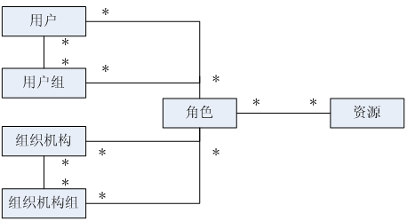
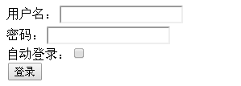
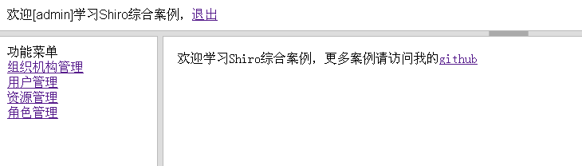
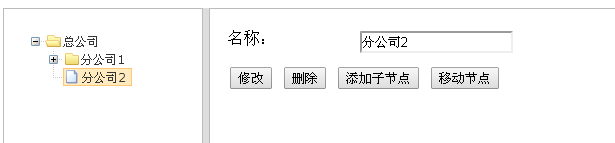
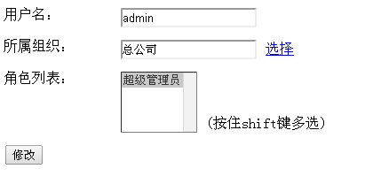
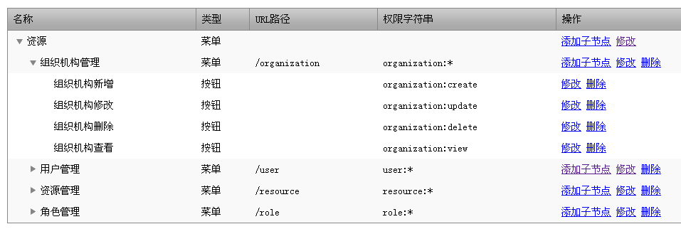
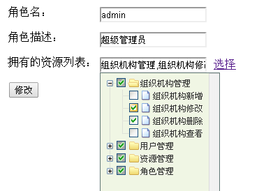

# 综合实例



## 简单数据字典

用户 (sys_user)

<table>
<tbody><tr>
<td>
<p class="MsoNormal"><span style="font-family: 宋体;">名称</span></p>
</td>
<td>
<p class="MsoNormal"><span style="font-family: 宋体;">类型</span></p>
</td>
<td>
<p class="MsoNormal"><span style="font-family: 宋体;">长度</span></p>
</td>
<td>
<p class="MsoNormal"><span style="font-family: 宋体;">描述</span></p>
</td>
</tr>
<tr>
<td>
<p class="MsoNormal"><span>id</span></p>
</td>
<td>
<p class="MsoNormal"><span>bigint</span></p>
</td>
<td>
<p class="MsoNormal"><span>&nbsp;</span></p>
</td>
<td>
<p class="MsoNormal"><span style="font-family: 宋体;">编号</span> <span style="font-family: 宋体;">主键</span></p>
</td>
</tr>
<tr>
<td>
<p class="MsoNormal"><span>username</span></p>
</td>
<td>
<p class="MsoNormal"><span>varchar</span></p>
</td>
<td>
<p class="MsoNormal"><span>100</span></p>
</td>
<td>
<p class="MsoNormal"><span style="font-family: 宋体;">用户名</span></p>
</td>
</tr>
<tr>
<td>
<p class="MsoNormal"><span>password</span></p>
</td>
<td>
<p class="MsoNormal"><span>varchar</span></p>
</td>
<td>
<p class="MsoNormal"><span>100</span></p>
</td>
<td>
<p class="MsoNormal"><span style="font-family: 宋体;">密码</span></p>
</td>
</tr>
<tr>
<td>
<p class="MsoNormal"><span>salt</span></p>
</td>
<td>
<p class="MsoNormal"><span>varchar</span></p>
</td>
<td>
<p class="MsoNormal"><span>50</span></p>
</td>
<td>
<p class="MsoNormal"><span style="font-family: 宋体;">盐</span></p>
</td>
</tr>
<tr>
<td>
<p class="MsoNormal"><span>role_ids</span></p>
</td>
<td>
<p class="MsoNormal"><span>varchar</span></p>
</td>
<td>
<p class="MsoNormal"><span>100</span></p>
</td>
<td>
<p class="MsoNormal"><span style="font-family: 宋体;">角色列表</span></p>
</td>
</tr>
<tr>
<td>
<p class="MsoNormal"><span>locked</span></p>
</td>
<td>
<p class="MsoNormal"><span>bool</span></p>
</td>
<td>
<p class="MsoNormal"><span>&nbsp;</span></p>
</td>
<td>
<p class="MsoNormal"><span style="font-family: 宋体;">账户是否锁定</span></p>
</td>
</tr>
</tbody></table>

组织机构 (sys_organization)  

<table>
<tbody><tr>
<td>
<p class="MsoNormal"><span style="font-family: 宋体;">名称</span></p>
</td>
<td>
<p class="MsoNormal"><span style="font-family: 宋体;">类型</span></p>
</td>
<td>
<p class="MsoNormal"><span style="font-family: 宋体;">长度</span></p>
</td>
<td>
<p class="MsoNormal"><span style="font-family: 宋体;">描述</span></p>
</td>
</tr>
<tr>
<td>
<p class="MsoNormal"><span>id</span></p>
</td>
<td>
<p class="MsoNormal"><span>bigint</span></p>
</td>
<td>
<p class="MsoNormal"><span>&nbsp;</span></p>
</td>
<td>
<p class="MsoNormal"><span style="font-family: 宋体;">编号</span> <span style="font-family: 宋体;">主键</span></p>
</td>
</tr>
<tr>
<td>
<p class="MsoNormal"><span>name</span></p>
</td>
<td>
<p class="MsoNormal"><span>varchar</span></p>
</td>
<td>
<p class="MsoNormal"><span>100</span></p>
</td>
<td>
<p class="MsoNormal"><span style="font-family: 宋体;">组织机构名</span></p>
</td>
</tr>
<tr>
<td>
<p class="MsoNormal"><span>priority</span></p>
</td>
<td>
<p class="MsoNormal"><span>int</span></p>
</td>
<td>
<p class="MsoNormal"><span>&nbsp;</span></p>
</td>
<td>
<p class="MsoNormal"><span style="font-family: 宋体;">显示顺序</span></p>
</td>
</tr>
<tr>
<td>
<p class="MsoNormal"><span>parent_id</span></p>
</td>
<td>
<p class="MsoNormal"><span>bigint</span></p>
</td>
<td>
<p class="MsoNormal"><span>&nbsp;</span></p>
</td>
<td>
<p class="MsoNormal"><span style="font-family: 宋体;">父编号</span></p>
</td>
</tr>
<tr>
<td>
<p class="MsoNormal"><span>parent_ids</span></p>
</td>
<td>
<p class="MsoNormal"><span>varchar</span></p>
</td>
<td>
<p class="MsoNormal"><span>100</span></p>
</td>
<td>
<p class="MsoNormal"><span style="font-family: 宋体;">父编号列表</span></p>
</td>
</tr>
<tr>
<td>
<p class="MsoNormal"><span>available</span></p>
</td>
<td>
<p class="MsoNormal"><span>bool</span></p>
</td>
<td>
<p class="MsoNormal"><span>&nbsp;</span></p>
</td>
<td>
<p class="MsoNormal"><span style="font-family: 宋体;">是否可用</span></p>
</td>
</tr>
</tbody></table>

资源 (sys_resource)  
<table style="border-collapse: collapse; border: none;" cellspacing="0" border="1" cellpadding="0" class="MsoNormalTable">
<tbody><tr>
<td>
<p class="MsoNormal"><span style="font-family: 宋体;">名称</span></p>
</td>
<td>
<p class="MsoNormal"><span style="font-family: 宋体;">类型</span></p>
</td>
<td>
<p class="MsoNormal"><span style="font-family: 宋体;">长度</span></p>
</td>
<td>
<p class="MsoNormal"><span style="font-family: 宋体;">描述</span></p>
</td>
</tr>
<tr>
<td>
<p class="MsoNormal"><span>id</span></p>
</td>
<td>
<p class="MsoNormal"><span>bigint</span></p>
</td>
<td>
<p class="MsoNormal"><span>&nbsp;</span></p>
</td>
<td>
<p class="MsoNormal"><span style="font-family: 宋体;">编号</span> <span style="font-family: 宋体;">主键</span></p>
</td>
</tr>
<tr>
<td>
<p class="MsoNormal"><span>name</span></p>
</td>
<td>
<p class="MsoNormal"><span>varchar</span></p>
</td>
<td>
<p class="MsoNormal"><span>100</span></p>
</td>
<td>
<p class="MsoNormal"><span style="font-family: 宋体;">资源名称</span></p>
</td>
</tr>
<tr>
<td>
<p class="MsoNormal"><span>type</span></p>
</td>
<td>
<p class="MsoNormal"><span>varchar</span></p>
</td>
<td>
<p class="MsoNormal"><span>50</span></p>
</td>
<td>
<p class="MsoNormal"><span style="font-family: 宋体;">资源类型，</span></p>
</td>
</tr>
<tr>
<td>
<p class="MsoNormal"><span>priority</span></p>
</td>
<td>
<p class="MsoNormal"><span>int</span></p>
</td>
<td>
<p class="MsoNormal"><span>&nbsp;</span></p>
</td>
<td>
<p class="MsoNormal"><span style="font-family: 宋体;">显示顺序</span></p>
</td>
</tr>
<tr>
<td>
<p class="MsoNormal"><span>parent_id</span></p>
</td>
<td>
<p class="MsoNormal"><span>bigint</span></p>
</td>
<td >
<p class="MsoNormal"><span>&nbsp;</span></p>
</td>
<td>
<p class="MsoNormal"><span style="font-family: 宋体;">父编号</span></p>
</td>
</tr>
<tr>
<td>
<p class="MsoNormal"><span>parent_ids</span></p>
</td>
<td>
<p class="MsoNormal"><span>varchar</span></p>
</td>
<td>
<p class="MsoNormal"><span>100</span></p>
</td>
<td>
<p class="MsoNormal"><span style="font-family: 宋体;">父编号列表</span></p>
</td>
</tr>
<tr>
<td>
<p class="MsoNormal"><span>permission</span></p>
</td>
<td>
<p class="MsoNormal"><span>varchar</span></p>
</td>
<td>
<p class="MsoNormal"><span>100</span></p>
</td>
<td>
<p class="MsoNormal"><span style="font-family: 宋体;">权限字符串</span></p>
</td>
</tr>
<tr>
<td>
<p class="MsoNormal"><span>available</span></p>
</td>
<td>
<p class="MsoNormal"><span>bool</span></p>
</td>
<td >
<p class="MsoNormal"><span>&nbsp;</span></p>
</td>
<td >
<p class="MsoNormal"><span style="font-family: 宋体;">是否可用</span></p>
</td>
</tr>
</tbody></table>

角色 (sys_role)  
<table style="border-collapse: collapse; border: none;" cellspacing="0" border="1" cellpadding="0" class="MsoNormalTable">
<tbody><tr>
<td>
<p class="MsoNormal"><span style="font-family: 宋体;">名称</span></p>
</td>
<td>
<p class="MsoNormal"><span style="font-family: 宋体;">类型</span></p>
</td>
<td>
<p class="MsoNormal"><span style="font-family: 宋体;">长度</span></p>
</td>
<td>
<p class="MsoNormal"><span style="font-family: 宋体;">描述</span></p>
</td>
</tr>
<tr>
<td >
<p class="MsoNormal"><span>id</span></p>
</td>
<td>
<p class="MsoNormal"><span>bigint</span></p>
</td>
<td>
<p class="MsoNormal"><span>&nbsp;</span></p>
</td>
<td >
<p class="MsoNormal"><span style="font-family: 宋体;">编号</span> <span style="font-family: 宋体;">主键</span></p>
</td>
</tr>
<tr>
<td>
<p class="MsoNormal"><span>role</span></p>
</td>
<td>
<p class="MsoNormal"><span>varchar</span></p>
</td>
<td >
<p class="MsoNormal"><span>100</span></p>
</td>
<td>
<p class="MsoNormal"><span style="font-family: 宋体;">角色名称</span></p>
</td>
</tr>
<tr>
<td>
<p class="MsoNormal"><span>description</span></p>
</td>
<td>
<p class="MsoNormal"><span>varchar</span></p>
</td>
<td>
<p class="MsoNormal"><span>100</span></p>
</td>
<td>
<p class="MsoNormal"><span style="font-family: 宋体;">角色描述</span></p>
</td>
</tr>
<tr>
<td>
<p class="MsoNormal"><span>resource_ids</span></p>
</td>
<td>
<p class="MsoNormal"><span>varchar</span></p>
</td>
<td >
<p class="MsoNormal"><span>100</span></p>
</td>
<td>
<p class="MsoNormal"><span style="font-family: 宋体;">授权的资源</span></p>
</td>
</tr>
<tr>
<td>
<p class="MsoNormal"><span>available</span></p>
</td>
<td >
<p class="MsoNormal"><span>bool</span></p>
</td>
<td>
<p class="MsoNormal"><span>&nbsp;</span></p>
</td>
<td>
<p class="MsoNormal"><span style="font-family: 宋体;">是否可用</span></p>
</td>
</tr>
</tbody></table>

**资源**：表示菜单元素、页面按钮元素等；菜单元素用来显示界面菜单的，页面按钮是每个页面可进行的操作，如新增、修改、删除按钮；使用 type 来区分元素类型（如 menu 表示菜单，button 代表按钮），priority 是元素的排序，如菜单显示顺序；permission 表示权限；如用户菜单使用 `user:*`；也就是把菜单授权给用户后，用户就拥有了 `user:*` 权限；如用户新增按钮使用 user:create，也就是把用户新增按钮授权给用户后，用户就拥有了 user:create 权限了；available 表示资源是否可用，如菜单显示 / 不显示。  

**角色**：role 表示角色标识符，如 admin，用于后台判断使用；description 表示角色描述，如超级管理员，用于前端显示给用户使用；resource_ids 表示该角色拥有的资源列表，即该角色拥有的权限列表（显示角色），即角色是权限字符串集合；available 表示角色是否可用。  

**组织机构**：name 表示组织机构名称，priority 是组织机构的排序，即显示顺序；available 表示组织机构是否可用。  

**用户**：username 表示用户名；password 表示密码；salt 表示加密密码的盐；role_ids 表示用户拥有的角色列表，可以通过角色再获取其权限字符串列表；locked 表示用户是否锁定。

此处如资源、组织机构都是树型结构：

<table>
<tbody><tr>
<td>
<p class="MsoNormal"><span>id</span></p>
</td>
<td>
<p class="MsoNormal"><span>name</span></p>
</td>
<td>
<p class="MsoNormal"><span>parent_id</span></p>
</td>
<td>
<p class="MsoNormal"><span>parent_ids</span></p>
</td>
</tr>
<tr>
<td>
<p class="MsoNormal"><span>1</span></p>
</td>
<td>
<p class="MsoNormal"><span style="font-family: 宋体;">总公司</span></p>
</td>
<td >
<p class="MsoNormal"><span>0</span></p>
</td>
<td >
<p class="MsoNormal"><span>0/</span></p>
</td>
</tr>
<tr>
<td>
<p class="MsoNormal"><span>2</span></p>
</td>
<td>
<p class="MsoNormal"><span style="font-family: 宋体;">山东分公司</span></p>
</td>
<td >
<p class="MsoNormal"><span>1</span></p>
</td>
<td >
<p class="MsoNormal"><span>0/1/</span></p>
</td>
</tr>
<tr>
<td >
<p class="MsoNormal"><span>3</span></p>
</td>
<td>
<p class="MsoNormal"><span style="font-family: 宋体;">河北分公司</span></p>
</td>
<td >
<p class="MsoNormal"><span>1</span></p>
</td>
<td>
<p class="MsoNormal"><span>0/1/</span></p>
</td>
</tr>
<tr>
<td>
<p class="MsoNormal"><span>4</span></p>
</td>
<td >
<p class="MsoNormal"><span style="font-family: 宋体;">济南分公司</span></p>
</td>
<td >
<p class="MsoNormal"><span>2</span></p>
</td>
<td >
<p class="MsoNormal"><span>0/1/2/</span></p>
</td>
</tr>
</tbody></table>

parent_id 表示父编号，parent_ids 表示所有祖先编号；如 0/1/2/ 表示其祖先是 2、1、0；其中根节点父编号为 0。  

为了简单性，如用户 - 角色，角色 - 资源关系直接在实体（用户表中的 role_ids，角色表中的 resource_ids）里完成的，没有建立多余的关系表，如要查询拥有 admin 角色的用户时，建议建立关联表，否则就没必要建立了。在存储关系时如 role_ids=1,2,3,；多个之间使用逗号分隔。
 
用户组、组织机构组本实例没有实现，即可以把一组权限授权给这些组，组中的用户 / 组织机构就自动拥有这些角色 / 权限了；另外对于用户组可以实现一个默认用户组，如论坛，不管匿名 / 登录用户都有查看帖子的权限。
 
更复杂的权限请参考我的《JavaEE 项目开发脚手架》：[http://github.com/zhangkaitao/es](http://github.com/zhangkaitao/es)。

## 表 / 数据 SQL  

具体请参考   
 
- sql/ shiro-schema.sql （表结构）  
- sql/ shiro-data.sql  （初始数据）  
 
默认用户名 / 密码是 admin/123456。

## 实体

具体请参考 com.github.zhangkaitao.shiro.chapter16.entity 包下的实体，此处就不列举了。
 
## DAO

具体请参考 com.github.zhangkaitao.shiro.chapter16.dao 包下的 DAO 接口及实现。
 
## Service

具体请参考 com.github.zhangkaitao.shiro.chapter16.service 包下的 Service 接口及实现。以下是出了基本 CRUD 之外的关键接口：

```
public interface ResourceService {
    Set<String> findPermissions(Set<Long> resourceIds); //得到资源对应的权限字符串
    List<Resource> findMenus(Set<String> permissions); //根据用户权限得到菜单
}
```

```
public interface RoleService {
    Set<String> findRoles(Long... roleIds); //根据角色编号得到角色标识符列表
    Set<String> findPermissions(Long[] roleIds); //根据角色编号得到权限字符串列表
}
```

```
public interface UserService {
    public void changePassword(Long userId, String newPassword); //修改密码
    public User findByUsername(String username); //根据用户名查找用户
    public Set<String> findRoles(String username);// 根据用户名查找其角色
    public Set<String> findPermissions(String username);// 根据用户名查找其权限
}&nbsp;
```

Service 实现请参考源代码，此处就不列举了。

## UserRealm 实现 

```
public class UserRealm extends AuthorizingRealm {
    @Autowired private UserService userService;
    protected AuthorizationInfo doGetAuthorizationInfo(PrincipalCollection principals) {
        String username = (String)principals.getPrimaryPrincipal();
        SimpleAuthorizationInfo authorizationInfo = new SimpleAuthorizationInfo();
        authorizationInfo.setRoles(userService.findRoles(username));
        authorizationInfo.setStringPermissions(userService.findPermissions(username));
        System.out.println(userService.findPermissions(username));
        return authorizationInfo;
    }
    protected AuthenticationInfo doGetAuthenticationInfo(AuthenticationToken token) throws AuthenticationException {
        String username = (String)token.getPrincipal();
        User user = userService.findByUsername(username);
        if(user == null) {
            throw new UnknownAccountException();//没找到帐号
        }
        if(Boolean.TRUE.equals(user.getLocked())) {
            throw new LockedAccountException(); //帐号锁定
        }
        return new SimpleAuthenticationInfo(
                user.getUsername(), //用户名
                user.getPassword(), //密码
                ByteSource.Util.bytes(user.getCredentialsSalt()),//salt=username+salt
                getName()  //realm name
        );
    }
}
```

此处的 UserRealm 和《第六章 Realm 及相关对象》中的 UserRealm 类似，通过 UserService 获取帐号及角色 / 权限信息。  

## Web 层控制器

```
@Controller
public class IndexController {
    @Autowired
    private ResourceService resourceService;
    @Autowired
    private UserService userService;
    @RequestMapping("/")
    public String index(@CurrentUser User loginUser, Model model) {
        Set<String> permissions = userService.findPermissions(loginUser.getUsername());
        List<Resource> menus = resourceService.findMenus(permissions);
        model.addAttribute("menus", menus);
        return "index";
    }
}&nbsp;
```

IndexController 中查询菜单在前台界面显示，请参考相应的 jsp 页面；

```
@Controller
public class LoginController {
    @RequestMapping(value = "/login")
    public String showLoginForm(HttpServletRequest req, Model model) {
        String exceptionClassName = (String)req.getAttribute("shiroLoginFailure");
        String error = null;
        if(UnknownAccountException.class.getName().equals(exceptionClassName)) {
            error = "用户名/密码错误";
        } else if(IncorrectCredentialsException.class.getName().equals(exceptionClassName)) {
            error = "用户名/密码错误";
        } else if(exceptionClassName != null) {
            error = "其他错误：" + exceptionClassName;
        }
        model.addAttribute("error", error);
        return "login";
    }
}&nbsp;
```

LoginController 用于显示登录表单页面，其中 shiro authc 拦截器进行登录，登录失败的话会把错误存到 shiroLoginFailure 属性中，在该控制器中获取后来显示相应的错误信息。

```
@RequiresPermissions("resource:view")
@RequestMapping(method = RequestMethod.GET)
public String list(Model model) {
    model.addAttribute("resourceList", resourceService.findAll());
    return "resource/list";
}&nbsp;
```

在控制器方法上使用 @RequiresPermissions 指定需要的权限信息，其他的都是类似的，请参考源码。  

## Web 层标签库  

com.github.zhangkaitao.shiro.chapter16.web.taglib.Functions 提供了函数标签实现，有根据编号显示资源 / 角色 / 组织机构名称，其定义放在 src/main/webapp/tld/zhang-functions.tld。

## Web 层异常处理器

```
@ControllerAdvice
public class DefaultExceptionHandler {
    @ExceptionHandler({UnauthorizedException.class})
    @ResponseStatus(HttpStatus.UNAUTHORIZED)
    public ModelAndView processUnauthenticatedException(NativeWebRequest request, UnauthorizedException e) {
        ModelAndView mv = new ModelAndView();
        mv.addObject("exception", e);
        mv.setViewName("unauthorized");
        return mv;
    }
}&nbsp;
```

如果抛出 UnauthorizedException，将被该异常处理器截获来显示没有权限信息。  

## Spring 配置——spring-config.xml

定义了 context:component-scan 来扫描除 web 层的组件、dataSource（数据源）、事务管理器及事务切面等；具体请参考配置源码。
 
## Spring 配置——spring-config-cache.xml  

定义了 spring 通用 cache，使用 ehcache 实现；具体请参考配置源码。
 
## Spring 配置——spring-config-shiro.xml

定义了 shiro 相关组件。 

```
<bean id="userRealm" class="com.github.zhangkaitao.shiro.chapter16.realm.UserRealm">
    <property name="credentialsMatcher" ref="credentialsMatcher"/>
    <property name="cachingEnabled" value="false"/>
</bean>&nbsp;
```

userRealm 组件禁用掉了 cache，可以参考 [https://github.com/zhangkaitao/es/tree/master/web/src/main/java/com/sishuok/es/extra/aop](https://github.com/zhangkaitao/es/tree/master/web/src/main/java/com/sishuok/es/extra/aop) 实现自己的 cache 切面；否则需要在修改如资源 / 角色等信息时清理掉缓存。

```
<bean id="sysUserFilter" 
class="com.github.zhangkaitao.shiro.chapter16.web.shiro.filter.SysUserFilter"/>&nbsp;
```

sysUserFilter 用于根据当前登录用户身份获取 User 信息放入 request；然后就可以通过 request 获取 User。  

```
<property name="filterChainDefinitions">
  <value>
    /login = authc
    /logout = logout
    /authenticated = authc
    /** = user,sysUser
  </value>
</property>&nbsp;
```

如上是 shiroFilter 的 filterChainDefinitions 定义。  

## Spring MVC 配置——spring-mvc.xml

定义了 spring mvc 相关组件。

```
<mvc:annotation-driven>
  <mvc:argument-resolvers>
    <bean class="com.github.zhangkaitao.shiro.chapter16
        .web.bind.method.CurrentUserMethodArgumentResolver"/>
  </mvc:argument-resolvers>
</mvc:annotation-driven>&nbsp;
```

此处注册了一个 @CurrentUser 参数解析器。如之前的 IndexController，从 request 获取 shiro sysUser 拦截器放入的当前登录 User 对象。  

## Spring MVC 配置——spring-mvc-shiro.xml  

定义了 spring mvc 相关组件。

```
<aop:config proxy-target-class="true"></aop:config>
<bean class="org.apache.shiro.spring.security
    .interceptor.AuthorizationAttributeSourceAdvisor">
  <property name="securityManager" ref="securityManager"/>
</bean>&nbsp;
```

定义 aop 切面，用于代理如 @RequiresPermissions 注解的控制器，进行权限控制。  

## web.xml 配置文件

定义 Spring ROOT 上下文加载器、ShiroFilter、及 SpringMVC 拦截器。具体请参考源码。

## JSP 页面

```
<shiro:hasPermission name="user:create">
    <a href="${pageContext.request.contextPath}/user/create">用户新增</a><br/>
</shiro:hasPermission>&nbsp;
```

使用 shiro 标签进行权限控制。具体请参考源码。

## 系统截图

访问 [http://localhost:8080/chapter16/](http://localhost:8080/chapter16/)；  
首先进入登录页面，输入用户名 / 密码（默认 admin/123456）登录：  



登录成功后到达整个页面主页，并根据当前用户权限显示相应的菜单，此处菜单比较简单，没有树型结构显示  



然后就可以进行一些操作，如组织机构维护、用户修改、资源维护、角色授权









## 相关资料

《跟我学 spring3》  
[http://www.iteye.com/blogs/subjects/spring3](http://www.iteye.com/blogs/subjects/spring3)
  
《跟开涛学 SpringMVC》  
[http://www.iteye.com/blogs/subjects/kaitao-springmvc](http://www.iteye.com/blogs/subjects/kaitao-springmvc)  

《简单 shiro 扩展实现 NOT、AND、OR 权限验证》  
[http://jinnianshilongnian.iteye.com/blog/1864800](http://jinnianshilongnian.iteye.com/blog/1864800)  

《Shiro+Struts2+Spring3 加上 @RequiresPermissions 后 @Autowired 失效》    
[http://jinnianshilongnian.iteye.com/blog/1850425](http://jinnianshilongnian.iteye.com/blog/1850425)
 
更复杂的权限请参考我的《JavaEE 项目开发脚手架》：[http://github.com/zhangkaitao/es](http://github.com/zhangkaitao/es)，提供了更加复杂的实现。