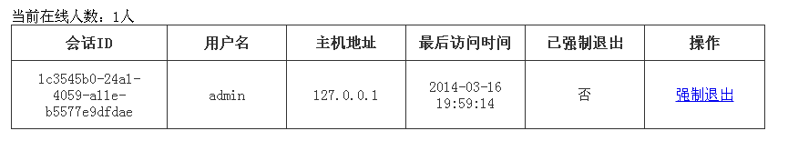
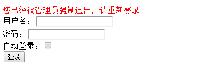

# 在线会话管理

有时候需要显示当前在线人数、当前在线用户，有时候可能需要强制某个用户下线等；此时就需要获取相应的在线用户并进行一些操作。
 
本章基于《第十六章 综合实例》代码构建。

## 会话控制器

```
@RequiresPermissions("session:*")
@Controller
@RequestMapping("/sessions")
public class SessionController {
    @Autowired
    private SessionDAO sessionDAO;
    @RequestMapping()
    public String list(Model model) {
        Collection<Session> sessions =  sessionDAO.getActiveSessions();
        model.addAttribute("sessions", sessions);
        model.addAttribute("sesessionCount", sessions.size());
        return "sessions/list";
    }
    @RequestMapping("/{sessionId}/forceLogout")
    public String forceLogout(@PathVariable("sessionId") String sessionId, 
        RedirectAttributes redirectAttributes) {
        try {
            Session session = sessionDAO.readSession(sessionId);
            if(session != null) {
                session.setAttribute(
                    Constants.SESSION_FORCE_LOGOUT_KEY, Boolean.TRUE);
            }
        } catch (Exception e) {/*ignore*/}
        redirectAttributes.addFlashAttribute("msg", "强制退出成功！");
        return "redirect:/sessions";
    }
}&nbsp;
```

1. list 方法：提供了展示所有在线会话列表，通过 sessionDAO.getActiveSessions() 获取所有在线的会话。
2. forceLogout 方法：强制退出某一个会话，此处只在指定会话中设置 Constants.SESSION_FORCE_LOGOUT_KEY 属性，之后通过 ForceLogoutFilter 判断并进行强制退出。
 
此处展示会话列表的缺点是：sessionDAO.getActiveSessions() 提供了获取所有活跃会话集合，如果做一般企业级应用问题不大，因为在线用户不多；但是如果应用的在线用户非常多，此种方法就不适合了，解决方案就是分页获取：

`Page<Session> getActiveSessions(int pageNumber, int pageSize);`

Page 对象除了包含 pageNumber、pageSize 属性之外，还包含 totalSessions（总会话数）、Collection<Session> （当前页的会话）。  

分页获取时，如果是 MySQL 这种关系数据库存储会话比较好办，如果使用 Redis 这种数据库可以考虑这样存储：  

```
session.id=会话序列化数据
session.ids=会话id Set列表（接着可以使用LLEN获取长度，LRANGE分页获取）&nbsp;
```

会话创建时（如 sessionId=123），那么 redis 命令如下所示：  

```
SET session.123 "Session序列化数据"
LPUSH session.ids 123   &nbsp;
```

会话删除时（如 sessionId=123），那么 redis 命令如下所示：  

```
DEL session.123
LREM session.ids 123   &nbsp;
```

获取总活跃会话：

`LLEN session.ids`

分页获取活跃会话：

```
LRANGE key 0 10 #获取到会话ID
MGET session.1 session.2……  #根据第一条命令获取的会话ID获取会话数据&nbsp;
```

## ForceLogoutFilter

```
public class ForceLogoutFilter extends AccessControlFilter {
    protected boolean isAccessAllowed(ServletRequest request, ServletResponse response, Object mappedValue) throws Exception {
        Session session = getSubject(request, response).getSession(false);
        if(session == null) {
            return true;
        }
        return session.getAttribute(Constants.SESSION_FORCE_LOGOUT_KEY) == null;
    }
    protected boolean onAccessDenied(ServletRequest request, ServletResponse response) throws Exception {
        try {
            getSubject(request, response).logout();//强制退出
        } catch (Exception e) {/*ignore exception*/}
        String loginUrl = getLoginUrl() + (getLoginUrl().contains("?") ? "&" : "?") + "forceLogout=1";
        WebUtils.issueRedirect(request, response, loginUrl);
        return false;
    }
}&nbsp;
```

强制退出拦截器，如果用户会话中存在 Constants.SESSION_FORCE_LOGOUT_KEY 属性，表示被管理员强制退出了；然后调用 Subject.logout() 退出，且重定向到登录页面（自动拼上 fourceLogout 请求参数）。  

## 登录控制器

在 LoginController 类的 showLoginForm 方法中最后添加如下代码：

```
if(req.getParameter("forceLogout") != null) {
    model.addAttribute("error", "您已经被管理员强制退出，请重新登录");
}&nbsp;
```

即如果有请求参数 forceLogout 表示是管理员强制退出的，在界面上显示相应的信息。

## Shiro 配置 spring-config-shiro.xml

和之前的唯一区别是在 shiroFilter 中的 filterChainDefinitions 拦截器链定义中添加了 forceLogout 拦截器：

`/** = forceLogout,user,sysUser`

## 测试

1、首先输入 `http://localhost:8080/chapter24/` 跳转到登录页面输入 admin/123456 登录；

2、登录成功后，点击菜单的 “会话管理”，可以看到当前在线会话列表： 



3、点击 “强制退出” 按钮，会话相应的用户再点击界面的话会看到如下界面，表示已经被强制退出了：



另外可参考我的 ES 中的在线会话管理功能：UserOnlineController.java，其使用数据库存储会话，并分页获取在线会话。
