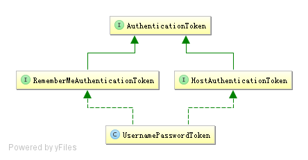
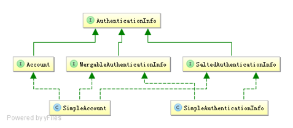
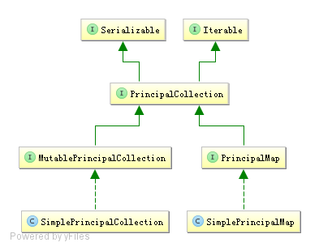
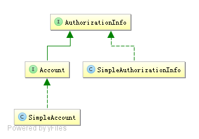
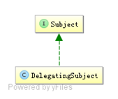

# Realm 及相关对象

## Realm

【Realm】及【Authorizer】部分都已经详细介绍过 Realm 了，接下来再来看一下一般真实环境下的 Realm 如何实现。  

**1、定义实体及关系**


即用户 - 角色之间是多对多关系，角色 - 权限之间是多对多关系；且用户和权限之间通过角色建立关系；在系统中验证时通过权限验证，角色只是权限集合，即所谓的显示角色；其实权限应该对应到资源（如菜单、URL、页面按钮、Java 方法等）中，即应该将权限字符串存储到资源实体中，但是目前为了简单化，直接提取一个权限表，【综合示例】部分会使用完整的表结构。  

用户实体包括：编号 (id)、用户名 (username)、密码 (password)、盐 (salt)、是否锁定 (locked)；是否锁定用于封禁用户使用，其实最好使用 Enum 字段存储，可以实现更复杂的用户状态实现。
角色实体包括：、编号 (id)、角色标识符（role）、描述（description）、是否可用（available）；其中角色标识符用于在程序中进行隐式角色判断的，描述用于以后再前台界面显示的、是否可用表示角色当前是否激活。
权限实体包括：编号（id）、权限标识符（permission）、描述（description）、是否可用（available）；含义和角色实体类似不再阐述。  

另外还有两个关系实体：用户 - 角色实体（用户编号、角色编号，且组合为复合主键）；角色 - 权限实体（角色编号、权限编号，且组合为复合主键）。  

sql 及实体请参考源代码中的 sql\shiro.sql 和 com.github.zhangkaitao.shiro.chapter6.entity 对应的实体。  

**2、环境准备**  

为了方便数据库操作，使用了 “org.springframework: spring-jdbc: 4.0.0.RELEASE” 依赖，虽然是 spring4 版本的，但使用上和 spring3 无区别。其他依赖请参考源码的 pom.xml。  

**3、定义 Service 及 Dao**

为了实现的简单性，只实现必须的功能，其他的可以自己实现即可。

**PermissionService**

```
public interface PermissionService {
    public Permission createPermission(Permission permission);
    public void deletePermission(Long permissionId);
}
```

实现基本的创建 / 删除权限。  

**RoleService**

```
public interface RoleService {
    public Role createRole(Role role);
    public void deleteRole(Long roleId);
    //添加角色-权限之间关系
    public void correlationPermissions(Long roleId, Long... permissionIds);
    //移除角色-权限之间关系
    public void uncorrelationPermissions(Long roleId, Long... permissionIds);//
}&nbsp;
```

相对于 PermissionService 多了关联 / 移除关联角色 - 权限功能。  

**UserService**

```
public interface UserService {
    public User createUser(User user); //创建账户
    public void changePassword(Long userId, String newPassword);//修改密码
    public void correlationRoles(Long userId, Long... roleIds); //添加用户-角色关系
    public void uncorrelationRoles(Long userId, Long... roleIds);// 移除用户-角色关系
    public User findByUsername(String username);// 根据用户名查找用户
    public Set<String> findRoles(String username);// 根据用户名查找其角色
    public Set<String> findPermissions(String username); //根据用户名查找其权限
}&nbsp;
```

此处使用 findByUsername、findRoles 及 findPermissions 来查找用户名对应的帐号、角色及权限信息。之后的 Realm 就使用这些方法来查找相关信息。  

**UserServiceImpl**

```
public User createUser(User user) {
    //加密密码
    passwordHelper.encryptPassword(user);
    return userDao.createUser(user);
}
public void changePassword(Long userId, String newPassword) {
    User user =userDao.findOne(userId);
    user.setPassword(newPassword);
    passwordHelper.encryptPassword(user);
    userDao.updateUser(user);
}&nbsp;
```

在创建账户及修改密码时直接把生成密码操作委托给 PasswordHelper。  

**PasswordHelper** 

```
public class PasswordHelper {
    private RandomNumberGenerator randomNumberGenerator =
     new SecureRandomNumberGenerator();
    private String algorithmName = "md5";
    private final int hashIterations = 2;
    public void encryptPassword(User user) {
        user.setSalt(randomNumberGenerator.nextBytes().toHex());
        String newPassword = new SimpleHash(
                algorithmName,
                user.getPassword(),
                ByteSource.Util.bytes(user.getCredentialsSalt()),
                hashIterations).toHex();
        user.setPassword(newPassword);
    }
}&nbsp;
```

之后的 CredentialsMatcher 需要和此处加密的算法一样。user.getCredentialsSalt() 辅助方法返回 username+salt。
 
为了节省篇幅，对于 DAO/Service 的接口及实现，具体请参考源码com.github.zhangkaitao.shiro.chapter6。另外请参考 Service 层的测试用例 com.github.zhangkaitao.shiro.chapter6.service.ServiceTest。

**4、定义 Realm**

**RetryLimitHashedCredentialsMatcher**   
和第五章的一样，在此就不罗列代码了，请参考源码   com.github.zhangkaitao.shiro.chapter6.credentials.RetryLimitHashedCredentialsMatcher。 

**UserRealm**

另外请参考 Service 层的测试用例 com.github.zhangkaitao.shiro.chapter6.service.ServiceTest。   

```
public class UserRealm extends AuthorizingRealm {
    private UserService userService = new UserServiceImpl();
    protected AuthorizationInfo doGetAuthorizationInfo(PrincipalCollection principals) {
        String username = (String)principals.getPrimaryPrincipal();
        SimpleAuthorizationInfo authorizationInfo = new SimpleAuthorizationInfo();
        authorizationInfo.setRoles(userService.findRoles(username));
        authorizationInfo.setStringPermissions(userService.findPermissions(username));
        return authorizationInfo;
    }
    protected AuthenticationInfo doGetAuthenticationInfo(AuthenticationToken token) throws AuthenticationException {
        String username = (String)token.getPrincipal();
        User user = userService.findByUsername(username);
        if(user == null) {
            throw new UnknownAccountException();//没找到帐号
        }
        if(Boolean.TRUE.equals(user.getLocked())) {
            throw new LockedAccountException(); //帐号锁定
        }
        //交给AuthenticatingRealm使用CredentialsMatcher进行密码匹配，如果觉得人家的不好可以在此判断或自定义实现
        SimpleAuthenticationInfo authenticationInfo = new SimpleAuthenticationInfo(
                user.getUsername(), //用户名
                user.getPassword(), //密码
                ByteSource.Util.bytes(user.getCredentialsSalt()),//salt=username+salt
                getName()  //realm name
        );
        return authenticationInfo;
    }
}&nbsp;
```

**1、UserRealm 父类 AuthorizingRealm 将获取 Subject 相关信息分成两步**：获取身份验证信息（doGetAuthenticationInfo）及授权信息（doGetAuthorizationInfo）；  

**2、doGetAuthenticationInfo 获取身份验证相关信息**：首先根据传入的用户名获取 User 信息；然后如果 user 为空，那么抛出没找到帐号异常 UnknownAccountException；如果 user 找到但锁定了抛出锁定异常 LockedAccountException；最后生成 AuthenticationInfo 信息，交给间接父类 AuthenticatingRealm 使用 CredentialsMatcher 进行判断密码是否匹配，如果不匹配将抛出密码错误异常 IncorrectCredentialsException；另外如果密码重试此处太多将抛出超出重试次数异常 ExcessiveAttemptsException；在组装 SimpleAuthenticationInfo 信息时，需要传入：身份信息（用户名）、凭据（密文密码）、盐（username+salt），CredentialsMatcher 使用盐加密传入的明文密码和此处的密文密码进行匹配。  

**3、doGetAuthorizationInfo 获取授权信息**：PrincipalCollection 是一个身份集合，因为我们现在就一个 Realm，所以直接调用 getPrimaryPrincipal 得到之前传入的用户名即可；然后根据用户名调用 UserService 接口获取角色及权限信息。  

**5、测试用例**  

为了节省篇幅，请参考测试用例 com.github.zhangkaitao.shiro.chapter6.realm.UserRealmTest。包含了：登录成功、用户名错误、密码错误、密码超出重试次数、有 / 没有角色、有 / 没有权限的测试。  

## AuthenticationToken



AuthenticationToken 用于收集用户提交的身份（如用户名）及凭据（如密码）：  

```
public interface AuthenticationToken extends Serializable {
    Object getPrincipal(); //身份
    Object getCredentials(); //凭据
}&nbsp;
```

扩展接口 RememberMeAuthenticationToken：提供了 “boolean isRememberMe()” 现“记住我”的功能；
扩展接口是 HostAuthenticationToken：提供了 “String getHost()” 方法用于获取用户 “主机” 的功能。
 
Shiro 提供了一个直接拿来用的 UsernamePasswordToken，用于实现用户名 / 密码 Token 组，另外其实现了 RememberMeAuthenticationToken 和 HostAuthenticationToken，可以实现记住我及主机验证的支持。
 
## AuthenticationInfo 



AuthenticationInfo 有两个作用：  

1. 如果 Realm 是 AuthenticatingRealm 子类，则提供给 AuthenticatingRealm 内部使用的 CredentialsMatcher 进行凭据验证；（如果没有继承它需要在自己的 Realm 中自己实现验证）；
2. 提供给 SecurityManager 来创建 Subject（提供身份信息）；

MergableAuthenticationInfo 用于提供在多 Realm 时合并 AuthenticationInfo 的功能，主要合并 Principal、如果是其他的如 credentialsSalt，会用后边的信息覆盖前边的。
 
比如 HashedCredentialsMatcher，在验证时会判断 AuthenticationInfo 是否是 SaltedAuthenticationInfo 子类，来获取盐信息。
 
Account 相当于我们之前的 User，SimpleAccount 是其一个实现；在 IniRealm、PropertiesRealm 这种静态创建帐号信息的场景中使用，这些 Realm 直接继承了 SimpleAccountRealm，而 SimpleAccountRealm 提供了相关的 API 来动态维护 SimpleAccount；即可以通过这些 API 来动态增删改查 SimpleAccount；动态增删改查角色 / 权限信息。及如果您的帐号不是特别多，可以使用这种方式，具体请参考 SimpleAccountRealm Javadoc。
 
其他情况一般返回 SimpleAuthenticationInfo 即可。  

## PrincipalCollection



因为我们可以在 Shiro 中同时配置多个 Realm，所以呢身份信息可能就有多个；因此其提供了 PrincipalCollection 用于聚合这些身份信息：  

```
public interface PrincipalCollection extends Iterable, Serializable {
    Object getPrimaryPrincipal(); //得到主要的身份
    <T> T oneByType(Class<T> type); //根据身份类型获取第一个
    <T> Collection<T> byType(Class<T> type); //根据身份类型获取一组
    List asList(); //转换为List
    Set asSet(); //转换为Set
    Collection fromRealm(String realmName); //根据Realm名字获取
    Set<String> getRealmNames(); //获取所有身份验证通过的Realm名字
    boolean isEmpty(); //判断是否为空
}&nbsp;
```

因为 PrincipalCollection 聚合了多个，此处最需要注意的是 getPrimaryPrincipal，如果只有一个 Principal 那么直接返回即可，如果有多个 Principal，则返回第一个（因为内部使用 Map 存储，所以可以认为是返回任意一个）；oneByType / byType 根据凭据的类型返回相应的 Principal；fromRealm 根据 Realm 名字（每个 Principal 都与一个 Realm 关联）获取相应的 Principal。
 
MutablePrincipalCollection 是一个可变的 PrincipalCollection 接口，即提供了如下可变方法：  

```
public interface MutablePrincipalCollection extends PrincipalCollection {
    void add(Object principal, String realmName); //添加Realm-Principal的关联
    void addAll(Collection principals, String realmName); //添加一组Realm-Principal的关联
    void addAll(PrincipalCollection principals);//添加PrincipalCollection
    void clear();//清空
}&nbsp;
```

目前 Shiro 只提供了一个实现 SimplePrincipalCollection，还记得之前的 AuthenticationStrategy 实现嘛，用于在多 Realm 时判断是否满足条件的，在大多数实现中（继承了 AbstractAuthenticationStrategy）afterAttempt 方法会进行 AuthenticationInfo（实现了 MergableAuthenticationInfo）的 merge，比如 SimpleAuthenticationInfo 会合并多个 Principal 为一个 PrincipalCollection。
 
对于 PrincipalMap 是 Shiro 1.2 中的一个实验品，暂时无用，具体可以参考其 Javadoc。接下来通过示例来看看 PrincipalCollection。  

**1、准备三个 Realm**

**MyRealm1**

```
public class MyRealm1 implements Realm {
    @Override
    public String getName() {
        return "a"; //realm name 为 “a”
    }
    //省略supports方法，具体请见源码
    @Override
    public AuthenticationInfo getAuthenticationInfo(AuthenticationToken token) throws AuthenticationException {
        return new SimpleAuthenticationInfo(
                "zhang", //身份 字符串类型
                "123",   //凭据
                getName() //Realm Name
        );
    }
}
```

**MyRealm2**
 
和 MyRealm1 完全一样，只是 Realm 名字为 b。

**MyRealm3**

```
public class MyRealm3 implements Realm {
    @Override
    public String getName() {
        return "c"; //realm name 为 “c”
    }
    //省略supports方法，具体请见源码
    @Override
    public AuthenticationInfo getAuthenticationInfo(AuthenticationToken token) throws AuthenticationException {
        User user = new User("zhang", "123");
        return new SimpleAuthenticationInfo(
                user, //身份 User类型
                "123",   //凭据
                getName() //Realm Name
        );
    }
}&nbsp;
```

和 MyRealm1 同名，但返回的 Principal 是 User 类型。

**2、ini 配置（shiro-multirealm.ini）**

```
[main]
realm1=com.github.zhangkaitao.shiro.chapter6.realm.MyRealm1
realm2=com.github.zhangkaitao.shiro.chapter6.realm.MyRealm2
realm3=com.github.zhangkaitao.shiro.chapter6.realm.MyRealm3
securityManager.realms=$realm1,$realm2,$realm3&nbsp;
```

**3、测试用例（com.github.zhangkaitao.shiro.chapter6.realm.PrincialCollectionTest）**

因为我们的 Realm 中没有进行身份及凭据验证，所以相当于身份验证都是成功的，都将返回：

```
Object primaryPrincipal1 = subject.getPrincipal();
PrincipalCollection princialCollection = subject.getPrincipals();
Object primaryPrincipal2 = princialCollection.getPrimaryPrincipal();&nbsp;
```

我们可以直接调用 subject.getPrincipal 获取 PrimaryPrincipal（即所谓的第一个）；或者通过 getPrincipals 获取 PrincipalCollection；然后通过其 getPrimaryPrincipal 获取 PrimaryPrincipal。  

`Set<String> realmNames = princialCollection.getRealmNames();`

获取所有身份验证成功的 Realm 名字。

`Set<Object> principals = princialCollection.asSet(); //asList 和 asSet 的结果一样`

将身份信息转换为 Set/List，即使转换为 List，也是先转换为 Set 再完成的。  

`Collection<User> users = princialCollection.fromRealm("c");`

根据 Realm 名字获取身份，因为 Realm 名字可以重复，所以可能多个身份，建议 Realm 名字尽量不要重复。  

## AuthorizationInfo



AuthorizationInfo 用于聚合授权信息的：  

```
public interface AuthorizationInfo extends Serializable {
    Collection<String> getRoles(); //获取角色字符串信息
    Collection<String> getStringPermissions(); //获取权限字符串信息
    Collection<Permission> getObjectPermissions(); //获取Permission对象信息
}&nbsp;
```

当我们使用 AuthorizingRealm 时，如果身份验证成功，在进行授权时就通过 doGetAuthorizationInfo 方法获取角色 / 权限信息用于授权验证。
 
Shiro 提供了一个实现 SimpleAuthorizationInfo，大多数时候使用这个即可。
 
对于 Account 及 SimpleAccount，之前的【6.3 AuthenticationInfo】已经介绍过了，用于 SimpleAccountRealm 子类，实现动态角色 / 权限维护的。  

## Subject  



Subject 是 Shiro 的核心对象，基本所有身份验证、授权都是通过 Subject 完成。  

**1、身份信息获取**

```
Object getPrincipal(); //Primary Principal
PrincipalCollection getPrincipals(); // PrincipalCollection&nbsp;
```

**2、身份验证**

```
void login(AuthenticationToken token) throws AuthenticationException;
boolean isAuthenticated();
boolean isRemembered();
```

通过 login 登录，如果登录失败将抛出相应的 AuthenticationException，如果登录成功调用 isAuthenticated 就会返回 true，即已经通过身份验证；如果 isRemembered 返回 true，表示是通过记住我功能登录的而不是调用 login 方法登录的。isAuthenticated/isRemembered 是互斥的，即如果其中一个返回 true，另一个返回 false。  

**3、角色授权验证**

```
boolean hasRole(String roleIdentifier);
boolean[] hasRoles(List<String> roleIdentifiers);
boolean hasAllRoles(Collection<String> roleIdentifiers);
void checkRole(String roleIdentifier) throws AuthorizationException;
void checkRoles(Collection<String> roleIdentifiers) throws AuthorizationException;
void checkRoles(String... roleIdentifiers) throws AuthorizationException;&nbsp;
```

hasRole * 进行角色验证，验证后返回 true/false；而 checkRole * 验证失败时抛出 AuthorizationException 异常。   

**4、权限授权验证**

```
boolean isPermitted(String permission);
boolean isPermitted(Permission permission);
boolean[] isPermitted(String... permissions);
boolean[] isPermitted(List<Permission> permissions);
boolean isPermittedAll(String... permissions);
boolean isPermittedAll(Collection<Permission> permissions);
void checkPermission(String permission) throws AuthorizationException;
void checkPermission(Permission permission) throws AuthorizationException;
void checkPermissions(String... permissions) throws AuthorizationException;
void checkPermissions(Collection<Permission> permissions) throws AuthorizationException;
```

isPermitted * 进行权限验证，验证后返回 true/false；而 checkPermission * 验证失败时抛出 AuthorizationException。  

**5、会话**

```
Session getSession(); //相当于getSession(true)
Session getSession(boolean create); &nbsp;
```

类似于 Web 中的会话。如果登录成功就相当于建立了会话，接着可以使用 getSession 获取；如果 create=false 如果没有会话将返回 null，而 create=true 如果没有会话会强制创建一个。  

**6、退出**

`void logout(); `

**7、RunAs**

```
void runAs(PrincipalCollection principals) throws NullPointerException, IllegalStateException;
boolean isRunAs();
PrincipalCollection getPreviousPrincipals();
PrincipalCollection releaseRunAs();&nbsp;
```

RunAs 即实现 “允许 A 假设为 B 身份进行访问”；通过调用 subject.runAs(b) 进行访问；接着调用 subject.getPrincipals 将获取到 B 的身份；此时调用 isRunAs 将返回 true；而 a 的身份需要通过 subject. getPreviousPrincipals 获取；如果不需要 RunAs 了调用 subject. releaseRunAs 即可。  

**8、多线程**

```
<V> V execute(Callable<V> callable) throws ExecutionException;
void execute(Runnable runnable);
<V> Callable<V> associateWith(Callable<V> callable);
Runnable associateWith(Runnable runnable);&nbsp;
```

实现线程之间的 Subject 传播，因为 Subject 是线程绑定的；因此在多线程执行中需要传播到相应的线程才能获取到相应的 Subject。最简单的办法就是通过 execute(runnable/callable 实例) 直接调用；或者通过 associateWith(runnable/callable 实例) 得到一个包装后的实例；它们都是通过：1、把当前线程的 Subject 绑定过去；2、在线程执行结束后自动释放。  

Subject 自己不会实现相应的身份验证 / 授权逻辑，而是通过 DelegatingSubject 委托给 SecurityManager 实现；及可以理解为 Subject 是一个面门。
 
对于 Subject 的构建一般没必要我们去创建；一般通过 SecurityUtils.getSubject() 获取：  

```
public static Subject getSubject() {
    Subject subject = ThreadContext.getSubject();
    if (subject == null) {
        subject = (new Subject.Builder()).buildSubject();
        ThreadContext.bind(subject);
    }
    return subject;
}&nbsp;
```

即首先查看当前线程是否绑定了 Subject，如果没有通过 Subject.Builder 构建一个然后绑定到现场返回。
 
如果想自定义创建，可以通过：  

`new Subject.Builder().principals(身份).authenticated(true/false).buildSubject() `

这种可以创建相应的 Subject 实例了，然后自己绑定到线程即可。在 new Builder() 时如果没有传入 SecurityManager，自动调用 SecurityUtils.getSecurityManager 获取；也可以自己传入一个实例。
 
对于 Subject 我们一般这么使用：  

1. 身份验证（login）
2. 授权（hasRole*/isPermitted * 或 checkRole*/checkPermission*）
3. 将相应的数据存储到会话（Session）
4. 切换身份（RunAs）/ 多线程身份传播
5. 退出

而我们必须的功能就是 1、2、5。到目前为止我们就可以使用 Shiro 进行应用程序的安全控制了，但是还是缺少如对 Web 验证、Java 方法验证等的一些简化实现。 


