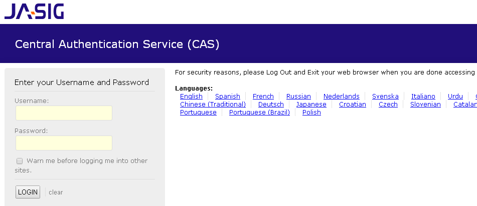
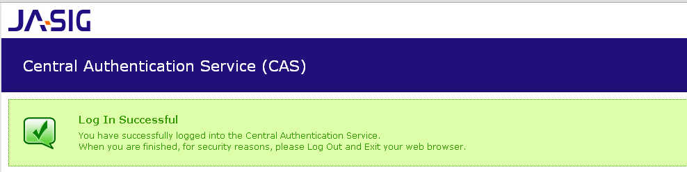

# 单点登录

Shiro 1.2 开始提供了 Jasig CAS 单点登录的支持，单点登录主要用于多系统集成，即在多个系统中，用户只需要到一个中央服务器登录一次即可访问这些系统中的任何一个，无须多次登录。此处我们使用 Jasig CAS v4.0.0-RC3 版本：  
[https://github.com/Jasig/cas/tree/v4.0.0-RC3](https://github.com/Jasig/cas/tree/v4.0.0-RC3)  

Jasig CAS 单点登录系统分为服务器端和客户端，服务器端提供单点登录，多个客户端（子系统）将跳转到该服务器进行登录验证，大体流程如下：  

1. 访问客户端需要登录的页面 `http://localhost:9080/client/`，此时会跳到单点登录服务器 `https://localhost:8443/server/login?service=https://localhost:9443/client/cas`；
2. 如果此时单点登录服务器也没有登录的话，会显示登录表单页面，输入用户名 / 密码进行登录；
3. 登录成功后服务器端会回调客户端传入的地址：`https://localhost:9443/client/cas?ticket=ST-1-eh2cIo92F9syvoMs5DOg-cas01.example.org`，且带着一个 ticket；
4. 客户端会把 ticket 提交给服务器来验证 ticket 是否有效；如果有效服务器端将返回用户身份；
5. 客户端可以再根据这个用户身份获取如当前系统用户 / 角色 / 权限信息。
 
本章使用了和《第十四章 SSL》一样的数字证书。

## 服务器端  

我们使用了 Jasig CAS 服务器 v4.0.0-RC3 版本，可以到其官方的 github 下载：`https://github.com/Jasig/cas/tree/v4.0.0-RC3` 下载，然后将其 cas-server-webapp 模块封装到 shiro-example-chapter15-server 模块中，具体请参考源码。

1、数字证书使用和《第十四章 SSL》一样的数字证书，即将 localhost.keystore 拷贝到 shiro-example-chapter15-server 模块根目录下；
 
2、在 pom.xml 中添加 Jetty Maven 插件，并添加 SSL 支持：

```
<plugin>
  <groupId>org.mortbay.jetty</groupId>
  <artifactId>jetty-maven-plugin</artifactId>
  <version>8.1.8.v20121106</version>
  <configuration>
    <webAppConfig>
      <contextPath>/${project.build.finalName}</contextPath>
    </webAppConfig>
    <connectors>
      <connector implementation="org.eclipse.jetty.server.nio.SelectChannelConnector">
        <port>8080</port>
      </connector>
      <connector implementation="org.eclipse.jetty.server.ssl.SslSocketConnector">
        <port>8443</port>
        <keystore>${project.basedir}/localhost.keystore</keystore>
       <password>123456</password>
        <keyPassword>123456</keyPassword>
      </connector>
    </connectors>
  </configuration>
</plugin>
```

3、修改 `src/main/webapp/WEB-INF/deployerConfigContext.xml`，找到 primaryAuthenticationHandler，然后添加一个账户：  

`<entry key="zhang" value="123"/>`

其也支持如 JDBC 查询，可以自己定制；具体请参考文档。  

4、mvn jetty:run 启动服务器测试即可：  
访问 `https://localhost:8443/chapter15-server/login` 将弹出如下登录页面：  



输入用户名 / 密码，如 zhang/123，将显示登录成功页面：  



到此服务器端的简单配置就完成了。  

## 客户端  

1、首先使用 localhost.keystore 导出数字证书（公钥）到 `D:\localhost.cer`  

`keytool -export -alias localhost -file D:\localhost.cer -keystore D:\localhost.keystore&nbsp;`

2、因为 CAS client 需要使用该证书进行验证，需要将证书导入到 JDK 中：  

```
cd D:\jdk1.7.0_21\jre\lib\security
keytool -import -alias localhost -file D:\localhost.cer -noprompt -trustcacerts -storetype jks -keystore cacerts -storepass 123456&nbsp;
```

如果导入失败，可以先把 security 目录下的 cacerts 删掉；  

3、按照服务器端的 Jetty Maven 插件的配置方式配置 Jetty 插件；  
 
4、在 shiro-example-chapter15-client 模块中导入 shiro-cas 依赖，具体请参考其 pom.xml；   
 
5、自定义 CasRealm：  

```
public class MyCasRealm extends CasRealm {
    private UserService userService;
    public void setUserService(UserService userService) {
        this.userService = userService;
    }
    @Override
    protected AuthorizationInfo doGetAuthorizationInfo(PrincipalCollection principals) {
        String username = (String)principals.getPrimaryPrincipal();
        SimpleAuthorizationInfo authorizationInfo = new SimpleAuthorizationInfo();
        authorizationInfo.setRoles(userService.findRoles(username));
        authorizationInfo.setStringPermissions(userService.findPermissions(username));
        return authorizationInfo;
    }
}&nbsp;
```

CasRealm 根据 CAS 服务器端返回的用户身份获取相应的角色 / 权限信息。  

6、spring-shiro-web.xml 配置：  

```
<bean id="casRealm" class="com.github.zhangkaitao.shiro.chapter13.realm.MyCasRealm">
    <property name="userService" ref="userService"/>
    ……
    <property name="casServerUrlPrefix" value="https://localhost:8443/chapter14-server"/>
    <property name="casService" value="https://localhost:9443/chapter14-client/cas"/>
</bean>&nbsp;
```

casServerUrlPrefix：是 CAS Server 服务器端地址；  
casService：是当前应用 CAS 服务 URL，即用于接收并处理登录成功后的 Ticket 的；  

如果角色 / 权限信息是由服务器端提供的话，我们可以直接使用 CasRealm：  

```
<bean id="casRealm" class="org.apache.shiro.cas.CasRealm">
    ……
    <property name="defaultRoles" value="admin,user"/>
    <property name="defaultPermissions" value="user:create,user:update"/>
    <property name="roleAttributeNames" value="roles"/>
    <property name="permissionAttributeNames" value="permissions"/>
    <property name="casServerUrlPrefix" value="https://localhost:8443/chapter14-server"/>
    <property name="casService" value="https://localhost:9443/chapter14-client/cas"/>
</bean>&nbsp;
```

defaultRoles/ defaultPermissions：默认添加给所有 CAS 登录成功用户的角色和权限信息；
roleAttributeNames/ permissionAttributeNames：角色属性 / 权限属性名称，如果用户的角色 / 权限信息是从服务器端返回的（即返回的 CAS Principal 中除了 Principal 之外还有如一些 Attributes），此时可以使用 roleAttributeNames/ permissionAttributeNames 得到 Attributes 中的角色 / 权限数据；请自行查询 CAS 获取用户更多信息。  

```
<bean id="casFilter" class="org.apache.shiro.cas.CasFilter">
    <property name="failureUrl" value="/casFailure.jsp"/>
</bean>&nbsp;
```

CasFilter 类似于 FormAuthenticationFilter，只不过其验证服务器端返回的 CAS Service Ticket。

```
<bean id="shiroFilter" class="org.apache.shiro.spring.web.ShiroFilterFactoryBean">
    <property name="securityManager" ref="securityManager"/>
    <property name="loginUrl" value="https://localhost:8443/chapter14-server/login?service=https://localhost:9443/chapter14-client/cas"/>
    <property name="successUrl" value="/"/>
    <property name="filters">
        <util:map>
            <entry key="cas" value-ref="casFilter"/>
        </util:map>
    </property>
    <property name="filterChainDefinitions">
        <value>
            /casFailure.jsp = anon
            /cas = cas
            /logout = logout
            /** = user
        </value>
    </property>
</bean>&nbsp;
```

`loginUrl：https://localhost:8443/chapter15-server/login` 表示服务端端登录地址，登录成功后跳转到?service 参数对于的地址进行客户端验证及登录；  
“/cas=cas”：即 /cas 地址是服务器端回调地址，使用 CasFilter 获取 Ticket 进行登录。  

7、测试，输入 `http://localhost:9080/chapter15-client` 地址进行测试即可，可以使用如 Chrome 开这 debug 观察网络请求的变化。  

如果遇到以下异常，一般是证书导入错误造成的，请尝试重新导入，如果还是不行，有可能是运行应用的 JDK 和安装数字证书的 JDK 不是同一个造成的：  

```
Caused by:   sun.security.validator.ValidatorException: PKIX path building failed: sun.security.provider.certpath.SunCertPathBuilderException: unable to find valid certification path to requested target  

at sun.security.validator.PKIXValidator.doBuild(PKIXValidator.java:385)
at sun.security.validator.PKIXValidator.engineValidate(PKIXValidator.java:292)
at sun.security.validator.Validator.validate(Validator.java:260)
at sun.security.ssl.X509TrustManagerImpl.validate(X509TrustManagerImpl.java:326)
at sun.security.ssl.X509TrustManagerImpl.checkTrusted(X509TrustManagerImpl.java:231)
at sun.security.ssl.X509TrustManagerImpl.checkServerTrusted(X509TrustManagerImpl.java:126)
at sun.security.ssl.ClientHandshaker.serverCertificate(ClientHandshaker.java:1323)
   ... 67 more  

Caused by: sun.security.provider.certpath.SunCertPathBuilderException: unable to find valid certification path to requested target

at sun.security.provider.certpath.SunCertPathBuilder.engineBuild(SunCertPathBuilder.java:196)
at java.security.cert.CertPathBuilder.build(CertPathBuilder.java:268)
at sun.security.validator.PKIXValidator.doBuild(PKIXValidator.java:380)
... 73 more

```